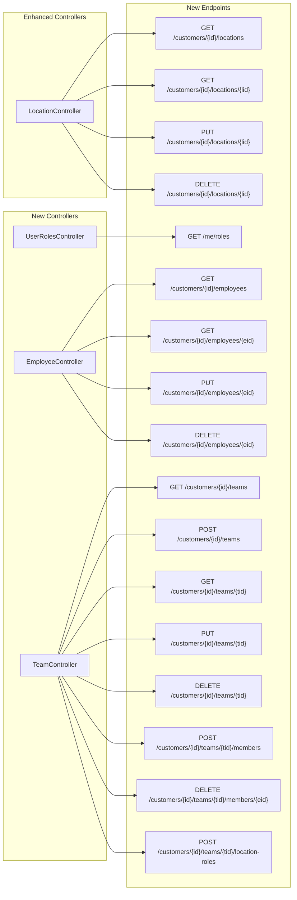
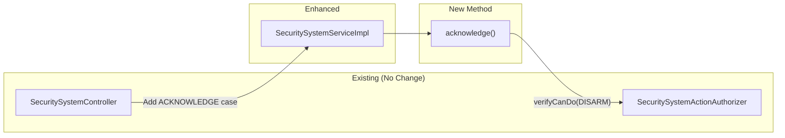
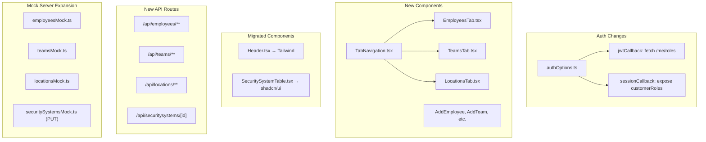
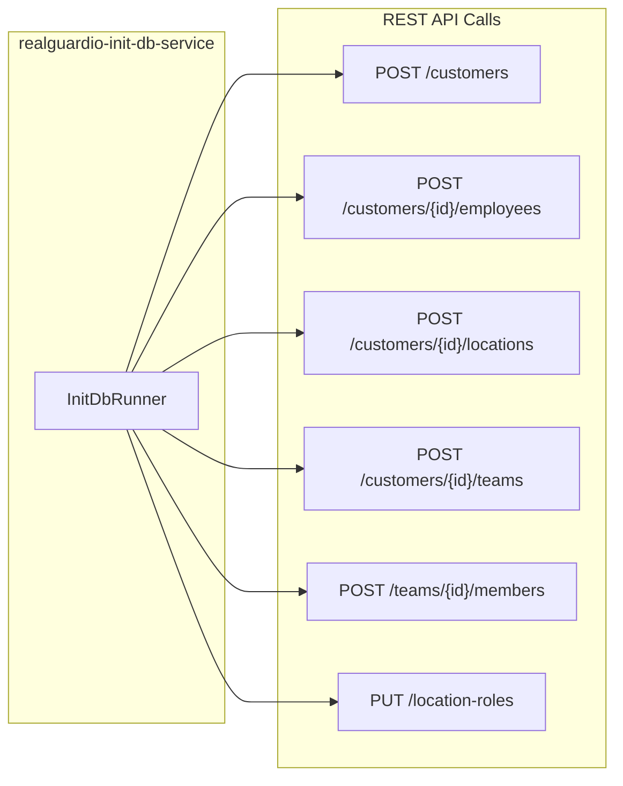

# Improve UX - Design Document

## 1. Overview

### Summary

This design describes changes to the existing RealGuardIO architecture to modernize the UI from a basic placeholder to a fully functional admin and security system management interface.

### Key Goals

1. Enable company admins to manage employees, teams, and locations via full CRUD UI
2. Enable security operators to arm/disarm/acknowledge security systems
3. Modernize UI with shadcn/ui component library
4. Implement role-based tab visibility
5. Provide demo-ready seed data via init-db-service

### Key Constraints

- Incremental development: Build UI features and supporting REST APIs together
- TDD workflow: All code developed test-first (outside-in)
- No breaking changes to existing APIs

---

## 2. Changes by Component

### 2.1 Customer Service (realguardio-customer-service)

#### Existing State

- REST endpoints: `GET /customers`, `POST /customers`, `POST /customers/{id}/employees`, `PUT /customers/{id}/location-roles`, `POST /customers/{id}/locations`, `GET /locations/{id}/roles`
- Domain: Customer, CustomerEmployee, Location, Team, CustomerEmployeeLocationRole, TeamLocationRole
- Services: CustomerService, LocationRoleService

#### Changes Required



| Change | Files Affected | Description |
|--------|----------------|-------------|
| **Add `GET /me/roles` endpoint** | New: `UserRolesController.java` | Returns `{ customerRoles, hasSecuritySystemAccess }` for current user |
| **Add employee CRUD endpoints** | New: `EmployeeController.java` | List, get, update, delete employees |
| **Add team CRUD endpoints** | New: `TeamController.java` | Full team management including members and location roles |
| **Add location CRUD endpoints** | Enhanced: `LocationController.java` | Add list, get, update, delete (create already exists) |
| **Add profile guard to DBInitializer** | Modified: `DbInitializerConfig.java` | Add `@Profile("!use-init-container")` |

#### New Files

```
customer-service-restapi/src/main/java/.../restapi/
├── UserRolesController.java      # GET /me/roles
├── EmployeeController.java       # Employee CRUD
└── TeamController.java           # Team CRUD + members + location roles

customer-service-restapi/src/test/java/.../restapi/
├── UserRolesControllerTest.java
├── EmployeeControllerTest.java
└── TeamControllerTest.java
```

---

### 2.2 Security System Service (realguardio-security-system-service)

#### Existing State

- REST endpoints: `GET /securitysystems`, `GET /securitysystems/{id}`, `PUT /securitysystems/{id}` (ARM/DISARM)
- Domain: SecuritySystem, SecuritySystemServiceImpl with `arm()`, `disarm()` methods
- Authorization: `SecuritySystemActionAuthorizer.verifyCanDo()` already implemented

#### Changes Required



| Change | Files Affected | Description |
|--------|----------------|-------------|
| **Add `acknowledge()` method** | Modified: `SecuritySystemServiceImpl.java` | Follow pattern of `arm()`/`disarm()`, use DISARM permission |
| **Handle ACKNOWLEDGE action** | Modified: `SecuritySystemController.java` | Add case in `updateSecuritySystem()` switch |
| **Add profile guard to DBInitializer** | Modified: `DBInitializerConfiguration.java` | Add `@Profile("!use-init-container")` |

#### Modified Files

```
security-system-service-domain/src/main/java/.../domain/
└── SecuritySystemServiceImpl.java   # Add acknowledge() method

security-system-service-restapi/src/main/java/.../restapi/
└── SecuritySystemController.java    # Handle ACKNOWLEDGE action

security-system-service-main/src/main/java/.../db/
└── DBInitializerConfiguration.java  # Add @Profile annotation
```

---

### 2.3 BFF (realguardio-bff)

#### Existing State

- NextJS 15.2.2 with next-auth 4.24.5
- OAuth2 PKCE authentication via authOptions.ts
- Single API route: `GET /api/securitysystems`
- Components: Header (styled-jsx), SecuritySystemTable (styled-jsx), VisibleInRole (unused)
- Mock server: Only `GET /securitysystems` endpoint

#### Changes Required



| Change | Files Affected | Description |
|--------|----------------|-------------|
| **Fetch customer roles in OAuth callback** | Modified: `authOptions.ts` | Call `GET /me/roles` in `jwtCallback`, refresh on token refresh |
| **Install shadcn/ui** | New: `components/ui/*` | Run `npx shadcn@latest init` and add components |
| **Create tab navigation** | New: `components/TabNavigation.tsx` | Role-filtered tabs using session.customerRoles |
| **Create admin tab components** | New: `components/*Tab.tsx` | EmployeesTab, TeamsTab, LocationsTab with CRUD |
| **Create dialog components** | New: `components/dialogs/*` | Add/Edit/Delete dialogs using shadcn/ui |
| **Migrate existing components** | Modified: `Header.tsx`, `SecuritySystemTable.tsx` | Replace styled-jsx with Tailwind + shadcn/ui |
| **Add API routes** | New: `app/api/**` | Proxy routes for all CRUD operations |
| **Wire up security system actions** | Modified: `SecuritySystemTable.tsx` | Call PUT API instead of console.log |
| **Expand mock server** | Modified/New: `mock-server/*` | Add all new endpoints |
| **Add E2E tests** | New: `__tests__/e2e/*` | Critical path tests |

#### New/Modified Files

```
# Auth
authOptions.ts                           # Modified: fetch customer roles

# Components (new)
components/
├── ui/                                  # shadcn/ui components (installed)
├── TabNavigation.tsx                    # Role-filtered tabs
├── EmployeesTab.tsx                     # Employee management
├── TeamsTab.tsx                         # Team management
├── LocationsTab.tsx                     # Location management
├── dialogs/
│   ├── AddEmployeeDialog.tsx
│   ├── AddTeamDialog.tsx
│   ├── AddLocationDialog.tsx
│   ├── AssignLocationRoleDialog.tsx
│   ├── AddTeamMemberDialog.tsx
│   └── ConfirmDeleteDialog.tsx
└── hooks/
    └── useCustomerRoles.ts              # Role checking hook

# Components (migrated)
components/
├── Header.tsx                           # Migrated to Tailwind
└── SecuritySystemTable.tsx              # Migrated to shadcn/ui, wired to API

# API Routes (new)
app/api/
├── employees/
│   ├── route.ts                         # GET (list), POST (create)
│   └── [id]/route.ts                    # GET, PUT, DELETE
├── teams/
│   ├── route.ts                         # GET (list), POST (create)
│   └── [id]/
│       ├── route.ts                     # GET, PUT, DELETE
│       ├── members/
│       │   ├── route.ts                 # POST (add member)
│       │   └── [employeeId]/route.ts    # DELETE (remove member)
│       └── location-roles/route.ts      # POST (add role)
├── locations/
│   ├── route.ts                         # GET (list), POST (create)
│   └── [id]/route.ts                    # GET, PUT, DELETE
└── securitysystems/
    └── [id]/route.ts                    # PUT (arm/disarm/acknowledge)

# Mock Server (expanded)
mock-server/
├── mockServerMain.ts                    # Modified: register new routes
├── securitySystemsMock.ts               # Modified: add PUT handler
├── employeesMock.ts                     # New
├── teamsMock.ts                         # New
└── locationsMock.ts                     # New

# Tests
__tests__/e2e/
├── adminFlow.test.ts                    # New: admin CRUD flows
└── securitySystemActions.test.ts        # New: arm/disarm/acknowledge
```

---

### 2.4 Init-DB Service (NEW - realguardio-init-db-service)

#### New Component



| What | Description |
|------|-------------|
| **Purpose** | Docker service that seeds demo data via REST APIs |
| **Lifecycle** | Runs once at startup, exits after seeding |
| **Data created** | 1 Customer, 2 Employees (admin + john.doe), 3 Locations, 1 Team, 3 Security Systems |

#### New Files

```
realguardio-init-db-service/
├── build.gradle
├── Dockerfile
├── settings.gradle
└── src/main/java/io/eventuate/examples/realguardio/initdb/
    ├── InitDbApplication.java           # Spring Boot main
    ├── InitDbRunner.java                # CommandLineRunner with seeding logic
    └── InitDbConfiguration.java         # RestTemplate/WebClient config
```

---

### 2.5 Docker Compose (docker-compose.yaml)

#### Changes Required

| Change | Description |
|--------|-------------|
| **Add init-db-service** | New service definition with `depends_on`, `restart: "no"` |
| **Add profile to existing services** | `SPRING_PROFILES_ACTIVE: ...,use-init-container` for customer-service and security-system-service |
| **Add CUSTOMER_SERVICE_URL to BFF** | Environment variable for role fetching |

#### Modified docker-compose.yaml

```yaml
# Add to realguardio-customer-service environment:
SPRING_PROFILES_ACTIVE: docker,UseOsoService,use-init-container

# Add to realguardio-security-system-service environment:
SPRING_PROFILES_ACTIVE: docker,use-init-container

# Add to realguardio-bff environment:
CUSTOMER_SERVICE_URL: http://realguardio-customer-service:8080

# New service:
realguardio-init-db-service:
  image: eventuate-examples-realguardio-init-db-service:latest
  build:
    context: ./realguardio-init-db-service
  environment:
    CUSTOMER_SERVICE_URL: http://realguardio-customer-service:8080
    SECURITY_SYSTEM_SERVICE_URL: http://realguardio-security-system-service:8080
  depends_on:
    realguardio-customer-service:
      condition: service_healthy
    realguardio-security-system-service:
      condition: service_healthy
  restart: "no"
```

---

## 3. Data Flow Changes

### 3.1 New: Customer Roles in Session

```
Login:
  User → BFF (OAuth2 PKCE) → IAM Service
  IAM Service → BFF (tokens)
  BFF (jwtCallback) → Customer Service (GET /me/roles)
  Customer Service → BFF ({ customerRoles, hasSecuritySystemAccess })
  BFF stores in session

Token Refresh (~2 min):
  BFF (jwtCallback) → Customer Service (GET /me/roles)
  Updated roles stored in session

Tab Rendering:
  TabNavigation reads session.customerRoles
  Shows/hides tabs based on COMPANY_ROLE_ADMIN presence
```

### 3.2 New: Security System Actions

```
Current (broken):
  User clicks ARM → console.log("ARM clicked")

New:
  User clicks ARM → SecuritySystemTable.handleAction("ARM")
  → fetch PUT /api/securitysystems/{id} { action: "ARM" }
  → BFF proxies to Security System Service
  → Service calls arm(), returns updated system
  → UI shows toast, refreshes table
```

---

## 4. Key Design Decisions

| Decision | Choice | Rationale |
|----------|--------|-----------|
| When to fetch customer roles | During OAuth callback, refresh on token refresh | Roles immediately available; no loading states for tabs |
| Where action filtering happens | Backend computes `actions` array | Authorization centralized; UI just renders what it receives |
| UI component library | shadcn/ui | Pre-built CRUD components; built on Tailwind (already configured) |
| How to seed demo data | Separate Docker service via REST APIs | Validates APIs work; creates IAM users through normal flow |

---

## 5. Open Questions

1. **Error handling for role fetch**: If `GET /me/roles` fails during OAuth callback, should login fail or proceed with no customer roles?

2. **Init-DB idempotency**: Should init-db-service check for existing data before creating, or always recreate?

3. **Cascade behavior**: When deleting a location or team, what happens to associated role assignments?

---

## Change History

### 2026-02-04: Initial design document created

- Created focusing on changes to existing architecture
- Documented changes by component with file listings
- Identified data flow changes and design decisions
