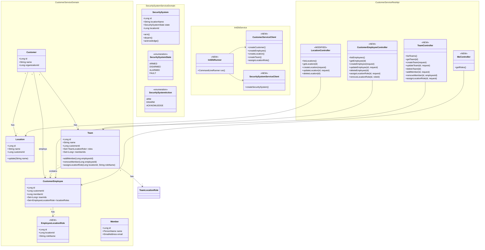
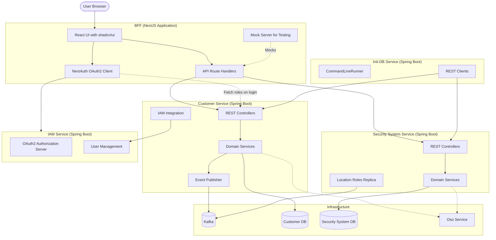
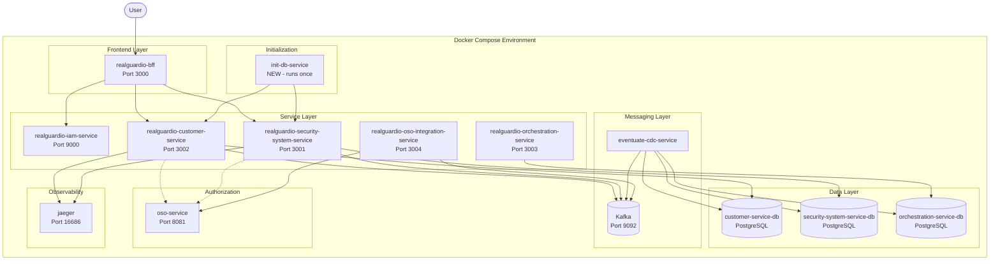

# Improve UX - Architecture Design Document

## 1. Overview

This feature modernizes the RealGuardIO UI from a basic placeholder to a fully functional admin and security system management interface. It bridges the gap between the capable microservices backend and the minimal existing UI.

### Key Changes

**Additions:**
- **Init-DB Service**: New Docker service that seeds demo data via REST API calls
- **Admin Management UI**: Full CRUD pages for employees, teams, and locations using shadcn/ui
- **New REST API Endpoints**: CRUD operations in Customer Service for employees, teams, locations
- **Customer Roles Session**: `GET /me/roles` endpoint and BFF session integration
- **Security System Actions**: Functional ARM/DISARM/ACKNOWLEDGE operations in UI

**Modifications:**
- **DBInitializer Classes**: Add Spring profile guards (`@Profile("!use-init-container")`)
- **Security System Service**: Add ACKNOWLEDGE action to PUT endpoint
- **BFF Authentication**: Fetch customer roles during OAuth callback
- **BFF UI**: Replace styled-jsx with shadcn/ui, add tab-based navigation

### Key Goals and Constraints

1. **Incremental Development**: Build UI features and supporting REST APIs together, one at a time
2. **Authorization-First**: Backend handles all authorization; UI simply renders authorized data
3. **Testing Strategy**: Comprehensive mock server for development; E2E tests against real stack
4. **Demo-Ready**: Init-DB service seeds all data needed to demonstrate features
5. **TDD Approach**: Follow Kent Beck style - one test at a time, commit with passing tests

---

## 2. Domain View

This section describes the programming language elements organized into subdomains.

### Package/Module Structure



### Domain Elements

**NEW: EmployeeLocationRole**
- Represents a direct location role assignment to an employee (distinct from team-inherited roles)
- Required for FR-2.6: Assign/remove location roles to individual employees

**NEW: CustomerEmployeeController**
- REST controller for employee CRUD operations
- Endpoints: `GET/POST /employees`, `GET/PUT/DELETE /employees/{id}`
- Required for FR-2.1 through FR-2.6

**NEW: TeamController**
- REST controller for team CRUD and member management
- Endpoints: `GET/POST /teams`, `GET/PUT/DELETE /teams/{id}`, member and role management
- Required for FR-3.1 through FR-3.7

**MODIFIED: LocationController**
- Add `PUT` and `DELETE` endpoints for location updates
- Required for FR-4.4 and FR-4.5

**NEW: MeController**
- Returns current user's customer roles and security system access flag
- Endpoint: `GET /me/roles`
- Required for customer roles in UI session (Q17 from discussion)

**MODIFIED: SecuritySystem.acknowledge()**
- Add acknowledge method to handle ALARMED state acknowledgment
- Required for FR-5.5

**NEW: InitDbRunner**
- Spring Boot CommandLineRunner that seeds demo data
- Calls REST APIs to create entities, then exits
- Required for FR-6.1 through FR-6.10

---

## 3. Component View

This section describes the logical organization of components and their interactions.



### Component Descriptions

**BFF (NextJS Application)**
- **React UI with shadcn/ui**: Modernized UI with tab navigation, data tables, forms, and dialogs
- **NextAuth OAuth2 Client**: Handles OAuth2 PKCE flow, stores customer roles in session
- **API Route Handlers**: Proxies requests to backend services with authentication headers
- **Mock Server**: MSW-based mock server for isolated UI testing

**Customer Service (Spring Boot)** - MODIFIED
- **REST Controllers**: NEW endpoints for employee, team, location CRUD and `/me/roles`
- **Domain Services**: NEW services for employee, team, location management
- **IAM Integration**: Existing - registers users with IAM service
- **Event Publisher**: Existing - publishes domain events to Kafka

**Security System Service (Spring Boot)** - MODIFIED
- **REST Controllers**: MODIFIED to support ACKNOWLEDGE action
- **Domain Services**: MODIFIED SecuritySystem.acknowledge() method
- **Location Roles Replica**: Existing - maintains replicated view of location roles

**Init-DB Service (Spring Boot)** - NEW
- **CommandLineRunner**: Runs once at startup, seeds data, then exits
- **REST Clients**: WebClient-based clients for Customer Service and Security System Service

**IAM Service (Spring Boot)** - UNCHANGED
- **OAuth2 Authorization Server**: Issues JWT tokens
- **User Management**: Creates users via POST /api/users

### Component Interfaces

| Component | Interface | Protocol | Purpose |
|-----------|-----------|----------|---------|
| BFF → Customer Service | REST API | HTTP/JSON | Employee, team, location CRUD |
| BFF → Security System Service | REST API | HTTP/JSON | Security system operations |
| BFF ← IAM Service | OAuth2 PKCE | HTTP | Authentication |
| Init-DB → Customer Service | REST API | HTTP/JSON | Seed demo data |
| Init-DB → Security System Service | REST API | HTTP/JSON | Seed security systems |
| Customer Service → IAM Service | REST API | HTTP/JSON | User registration |
| Customer Service → Kafka | Events | Kafka | Domain events |
| Security System Service ← Kafka | Events | Kafka | Location roles updates |

---

## 4. Deployment View

This section describes the runtime environment and deployment configuration.



### Deployment Artifacts

**NEW: init-db-service Container**
- Spring Boot application packaged as Docker image
- Runs once at startup via `docker-compose run` or `restart: on-failure`
- Depends on: customer-service, security-system-service, iam-service
- Environment: `SPRING_PROFILES_ACTIVE=docker`

**MODIFIED: realguardio-customer-service Container**
- Add profile flag when using init-db: `use-init-container`
- Existing DBInitializer disabled via `@Profile("!use-init-container")`

**MODIFIED: realguardio-security-system-service Container**
- Add profile flag when using init-db: `use-init-container`
- Existing DBInitializer disabled via `@Profile("!use-init-container")`

**MODIFIED: realguardio-bff Container**
- Updated UI with shadcn/ui components
- Customer roles fetched during OAuth callback

### Startup Sequence

1. Start infrastructure: `docker-compose up -d kafka customer-service-db security-system-service-db orchestration-service-db`
2. Start CDC service: `docker-compose up -d cdc`
3. Start Oso service: `docker-compose up -d oso-service`
4. Start IAM service: `docker-compose up -d realguardio-iam-service`
5. Start microservices: `docker-compose up -d realguardio-customer-service realguardio-security-system-service realguardio-orchestration-service realguardio-oso-integration-service`
6. Run init-db service: `docker-compose run --rm init-db-service`
7. Start BFF: `docker-compose up -d realguardio-bff`

### Shutdown Sequence

1. Stop BFF: `docker-compose stop realguardio-bff`
2. Stop microservices: `docker-compose stop realguardio-customer-service realguardio-security-system-service realguardio-orchestration-service realguardio-oso-integration-service`
3. Stop IAM service: `docker-compose stop realguardio-iam-service`
4. Stop Oso service: `docker-compose stop oso-service`
5. Stop CDC service: `docker-compose stop cdc`
6. Stop infrastructure: `docker-compose down`

### Environment Configuration

**Init-DB Service Environment Variables:**
```yaml
CUSTOMER_SERVICE_URL: http://realguardio-customer-service:8080
SECURITY_SYSTEM_SERVICE_URL: http://realguardio-security-system-service:8080
SPRING_PROFILES_ACTIVE: docker
```

**Customer/Security System Service Profile Addition:**
```yaml
SPRING_PROFILES_ACTIVE: docker,use-init-container
```

---

## 5. Build View

This section describes source code organization and build pipelines.

```mermaid
flowchart TB
    subgraph Repository["eventuate-examples-realguardio"]
        subgraph NewService["init-db-service/ (NEW)"]
            IDB_Main[init-db-service-main/]
            IDB_Clients[init-db-service-clients/]
        end

        subgraph CustomerService["realguardio-customer-service/"]
            CS_Domain[customer-service-domain/]
            CS_RestApi[customer-service-restapi/]
            CS_Main[customer-service-main/]
        end

        subgraph SecurityService["realguardio-security-system-service/"]
            SS_Domain[security-system-service-domain/]
            SS_RestApi[security-system-service-restapi/]
            SS_Main[security-system-service-main/]
        end

        subgraph BFF["realguardio-bff/"]
            BFF_App[app/]
            BFF_Components[components/]
            BFF_Types[types/]
            BFF_Lib[lib/]
            BFF_Tests[__tests__/]
            BFF_E2E[e2e/]
        end

        subgraph E2E["end-to-end-tests/"]
            E2E_Tests[src/integrationTest/]
        end

        Docs[docs/features/improve-ux/]
        Docker[docker-compose.yaml]
    end

    subgraph BuildPipeline["Build Pipeline"]
        Lint[Lint & Type Check]
        UnitTest[Unit Tests]
        IntegTest[Integration Tests]
        BuildImages[Build Docker Images]
        E2ETest[E2E Tests]
    end

    CS_Domain --> UnitTest
    CS_RestApi --> UnitTest
    SS_Domain --> UnitTest
    BFF_Components --> UnitTest

    CS_Main --> IntegTest
    SS_Main --> IntegTest
    IDB_Main --> IntegTest

    BuildImages --> E2ETest
    E2E_Tests --> E2ETest
    BFF_E2E --> E2ETest
```



### Source Code Structure

**NEW: init-db-service/**
```
init-db-service/
├── build.gradle                    # Root build file
├── gradlew                         # Gradle wrapper
├── settings.gradle                 # Subproject settings
├── init-db-service-main/
│   └── src/main/java/
│       └── io/eventuate/examples/realguardio/initdb/
│           ├── InitDbServiceMain.java
│           └── InitDbRunner.java
└── init-db-service-clients/
    └── src/main/java/
        └── io/eventuate/examples/realguardio/initdb/clients/
            ├── CustomerServiceClient.java
            └── SecuritySystemServiceClient.java
```

**MODIFIED: realguardio-customer-service/**
```
realguardio-customer-service/
├── customer-service-domain/
│   └── src/main/java/.../domain/
│       ├── EmployeeLocationRole.java          # NEW
│       ├── CustomerEmployee.java              # MODIFIED - add locationRoles
│       ├── CustomerEmployeeService.java       # NEW
│       ├── TeamService.java                   # NEW
│       └── LocationService.java               # NEW
├── customer-service-restapi/
│   └── src/main/java/.../restapi/
│       ├── CustomerEmployeeController.java    # NEW
│       ├── TeamController.java                # NEW
│       ├── LocationController.java            # MODIFIED
│       ├── MeController.java                  # NEW
│       └── dto/                               # NEW request/response DTOs
└── customer-service-main/
    └── src/main/java/.../
        └── DbInitializerConfig.java           # MODIFIED - add @Profile
```

**MODIFIED: realguardio-security-system-service/**
```
realguardio-security-system-service/
├── security-system-service-domain/
│   └── src/main/java/.../domain/
│       └── SecuritySystem.java                # MODIFIED - add acknowledge()
└── security-system-service-main/
    └── src/main/java/.../
        └── DBInitializerConfiguration.java    # MODIFIED - add @Profile
```

**MODIFIED: realguardio-bff/**
```
realguardio-bff/
├── app/
│   ├── page.tsx                               # MODIFIED - tab navigation
│   ├── employees/
│   │   └── page.tsx                           # NEW
│   ├── teams/
│   │   └── page.tsx                           # NEW
│   ├── locations/
│   │   └── page.tsx                           # NEW
│   └── api/
│       ├── employees/
│       │   ├── route.ts                       # NEW
│       │   └── [id]/route.ts                  # NEW
│       ├── teams/
│       │   ├── route.ts                       # NEW
│       │   └── [id]/
│       │       ├── route.ts                   # NEW
│       │       ├── members/route.ts           # NEW
│       │       └── location-roles/route.ts    # NEW
│       ├── locations/
│       │   ├── route.ts                       # NEW
│       │   └── [id]/route.ts                  # NEW
│       └── securitysystems/
│           └── [id]/route.ts                  # NEW
├── components/
│   ├── ui/                                    # NEW - shadcn/ui components
│   │   ├── button.tsx
│   │   ├── table.tsx
│   │   ├── dialog.tsx
│   │   ├── toast.tsx
│   │   ├── tabs.tsx
│   │   └── form.tsx
│   ├── navigation/
│   │   └── TabNavigation.tsx                  # NEW
│   ├── employees/
│   │   ├── EmployeeTable.tsx                  # NEW
│   │   ├── EmployeeForm.tsx                   # NEW
│   │   └── EmployeeDetail.tsx                 # NEW
│   ├── teams/
│   │   ├── TeamTable.tsx                      # NEW
│   │   ├── TeamForm.tsx                       # NEW
│   │   └── TeamDetail.tsx                     # NEW
│   ├── locations/
│   │   ├── LocationTable.tsx                  # NEW
│   │   ├── LocationForm.tsx                   # NEW
│   │   └── LocationDetail.tsx                 # NEW
│   └── security-systems/
│       └── SecuritySystemTable.tsx            # MODIFIED - functional actions
├── lib/
│   ├── api-client.ts                          # NEW - typed API client
│   └── auth.ts                                # MODIFIED - customer roles
├── types/
│   ├── employee.ts                            # NEW
│   ├── team.ts                                # NEW
│   ├── location.ts                            # NEW
│   └── session.d.ts                           # MODIFIED - customer roles
├── __tests__/
│   ├── components/                            # NEW - component tests
│   └── mocks/
│       └── handlers.ts                        # MODIFIED - expanded mock handlers
├── e2e/
│   ├── pages/                                 # NEW - Page Objects
│   │   ├── EmployeesPage.ts
│   │   ├── TeamsPage.ts
│   │   ├── LocationsPage.ts
│   │   └── SecuritySystemsPage.ts
│   └── tests/                                 # NEW - E2E tests
│       ├── admin-onboard-employee.spec.ts
│       └── security-system-operations.spec.ts
├── tailwind.config.ts                         # MODIFIED - shadcn/ui config
└── components.json                            # NEW - shadcn/ui config
```

**NEW: docker-compose.yaml additions**
```yaml
# Add to services section
init-db-service:
  build: ./init-db-service
  depends_on:
    realguardio-customer-service:
      condition: service_healthy
    realguardio-security-system-service:
      condition: service_healthy
  environment:
    CUSTOMER_SERVICE_URL: http://realguardio-customer-service:8080
    SECURITY_SYSTEM_SERVICE_URL: http://realguardio-security-system-service:8080
  restart: "no"
```

### Dataflow

1. **Build Configuration Flow**
   - `settings.gradle` defines subprojects
   - `build.gradle` defines dependencies and tasks
   - Gradle wrapper (`gradlew`) executes builds

2. **Init-DB Data Seeding Flow**
   - `InitDbRunner` starts on application boot
   - Calls `CustomerServiceClient.createCustomer()` → Customer Service REST API
   - Calls `CustomerServiceClient.createEmployee()` → triggers IAM user registration
   - Calls `CustomerServiceClient.createLocation()` → creates locations
   - Calls `CustomerServiceClient.createTeam()` → creates teams with members and roles
   - Calls `SecuritySystemServiceClient.createSecuritySystem()` → via Orchestration Service
   - Application exits after seeding complete

3. **Authentication Flow**
   - User clicks login in BFF
   - NextAuth redirects to IAM Service OAuth2 authorize endpoint
   - User authenticates, IAM issues authorization code
   - NextAuth exchanges code for tokens
   - **NEW**: In `jwtCallback`, BFF calls `GET /me/roles` on Customer Service
   - Customer roles stored in session alongside IAM roles
   - Session refreshes roles on token refresh (~2 min)

4. **UI Data Flow**
   - React components fetch data via `lib/api-client.ts`
   - API client calls BFF API routes (`/api/employees`, etc.)
   - BFF routes proxy to backend services with auth headers
   - Backend returns authorized data based on JWT claims
   - UI renders data with role-filtered actions

### Testing Strategy

| Test Type | Location | Framework | Purpose |
|-----------|----------|-----------|---------|
| Unit Tests (Java) | `*/src/test/java/` | JUnit 5, AssertJ | Domain logic, services |
| Integration Tests (Java) | `*/src/integrationTest/java/` | Spring Boot Test | REST APIs with DB |
| Component Tests (React) | `realguardio-bff/__tests__/` | Jest, Testing Library | UI components |
| Mock Server Tests | `realguardio-bff/__tests__/` | MSW | API integration |
| E2E Tests | `realguardio-bff/e2e/` | Playwright | Full user flows |
| E2E Tests (Backend) | `end-to-end-tests/` | JUnit 5 | Service integration |

### CI/CD Pipeline

```
1. Lint & Type Check
   - Java: ./gradlew check (per service)
   - TypeScript: npm run lint && npm run type-check

2. Unit Tests
   - Java: ./gradlew test (per service)
   - React: npm test

3. Integration Tests
   - Java: ./gradlew integrationTest (per service)

4. Build Docker Images
   - ./gradlew buildDockerImageLocally (per service)
   - npm run build (BFF)

5. E2E Tests
   - docker-compose up
   - docker-compose run init-db-service
   - npm run test:e2e (Playwright)
   - ./gradlew integrationTest (end-to-end-tests)
```

---

## 6. Key Design Decisions

### Decision 1: Separate Init-DB Service vs. Enhanced DBInitializers

**Chosen**: Separate Docker service that calls REST APIs

**Rationale**:
- REST API calls exercise the same code paths production uses
- IAM user registration happens naturally via CustomerService → IAM integration
- Easier to test and debug in isolation
- Existing DBInitializers can remain for local development (without init container)

**Trade-offs**:
- Requires health checks and startup ordering
- Slightly more complex docker-compose configuration
- Could fail if services aren't ready (mitigated by depends_on conditions)

### Decision 2: Customer Roles Fetch Strategy

**Chosen**: Fetch during OAuth callback, refresh on token refresh

**Rationale**:
- Single API call on login, minimal latency impact
- Roles cached in session, no extra calls on page navigation
- ~2 minute refresh catches role changes reasonably quickly
- Simpler than real-time WebSocket updates

**Trade-offs**:
- Role changes take up to 2 minutes to reflect
- Session size slightly larger with customer roles

### Decision 3: shadcn/ui Component Library

**Chosen**: shadcn/ui with Tailwind CSS

**Rationale**:
- Components copied into codebase, no runtime dependency
- Built on Radix UI primitives for accessibility
- Tailwind already configured in existing BFF
- Active community and good documentation

**Trade-offs**:
- More files in the codebase vs. npm dependency
- Need to manually update components for bug fixes

### Decision 4: Backend Authorization Only

**Chosen**: All authorization decisions made by backend; UI only renders what it receives

**Rationale**:
- Single source of truth for authorization (Oso)
- UI cannot be bypassed by malicious requests
- Simpler UI logic - just render data and enabled actions
- Consistent with existing architecture

**Trade-offs**:
- UI cannot optimistically hide unauthorized actions before data loads
- Requires loading states while fetching

### Decision 5: Page Object Pattern for E2E Tests

**Chosen**: Page Objects encapsulating UI interactions

**Rationale**:
- Mentioned in project CLAUDE.md guidelines
- Reduces test duplication
- Makes tests more maintainable when UI changes
- Separates "what" from "how" in test code

---

## 7. Technical Risks and Mitigations

### Risk 1: Init-DB Service Race Conditions

**Risk**: Services may not be fully ready when init-db starts despite depends_on.

**Mitigation**:
- Use `condition: service_healthy` with proper health checks
- Implement retry logic with exponential backoff in init-db clients
- Log clear error messages for debugging

### Risk 2: Session Size with Customer Roles

**Risk**: Storing customer roles in session may bloat JWT or cookie size.

**Mitigation**:
- Store minimal role data (role names, not full objects)
- Use `hasSecuritySystemAccess` boolean flag instead of full role list for tab visibility
- Monitor session/cookie sizes during testing

### Risk 3: Authorization Sync Latency

**Risk**: Customer role changes may not immediately reflect in Oso facts.

**Mitigation**:
- Existing CDC and event subscriber architecture handles propagation
- Test with role change scenarios
- Document expected propagation delay

### Risk 4: styled-jsx to shadcn/ui Migration Complexity

**Risk**: Migrating existing UI may break styling or behavior.

**Mitigation**:
- Incremental migration - replace one component at a time
- Visual regression testing with screenshots
- Keep styled-jsx temporarily until migration complete

### Risk 5: Mock Server Drift

**Risk**: Mock server behavior diverges from real backend over time.

**Mitigation**:
- Contract tests comparing mock responses to real responses
- E2E tests against real stack catch integration issues
- Document mock server maintenance in development workflow

---

## 8. Open Questions

### Q1: Security System Creation via Init-DB

The spec mentions creating security systems but the current flow goes through Orchestration Service (saga pattern). Should init-db:
1. Call Orchestration Service's POST /securitysystems endpoint (uses saga)?
2. Call Security System Service directly (bypasses saga)?

**Recommendation**: Use Orchestration Service to exercise real code path.

### Q2: Delete Cascading Behavior

When deleting entities, what should happen to related data?
- Delete employee → remove from teams? Delete location role assignments?
- Delete team → what happens to team location roles?
- Delete location → what happens to security systems?

**Recommendation**: Clarify in implementation plan; likely soft-delete or prevent delete with dependencies.

### Q3: Employee Location Role UI

The spec describes assigning location roles to individual employees (FR-2.6). The current domain model has `TeamLocationRole` but not direct `EmployeeLocationRole`. Should we:
1. Add new `EmployeeLocationRole` entity?
2. Use existing infrastructure differently?

**Recommendation**: Add `EmployeeLocationRole` entity for direct assignments, distinct from team-inherited roles.

### Q4: Confirmation Dialog Scope

The spec says "confirmation dialogs for delete operations only." Should this include:
- Removing team members?
- Removing location roles?

**Recommendation**: Only for actual DELETE operations (delete employee, team, location), not for remove operations that don't destroy data.

---

## Change History

### 2026-02-04: Initial design document created

- Created based on improve-ux-idea.md, improve-ux-discussion.md, and improve-ux-spec.md
- Explored existing codebase architecture
- Documented four architectural views: Domain, Component, Deployment, Build
- Identified 5 key design decisions with rationale
- Listed 5 technical risks with mitigations
- Captured 4 open questions for implementation planning
