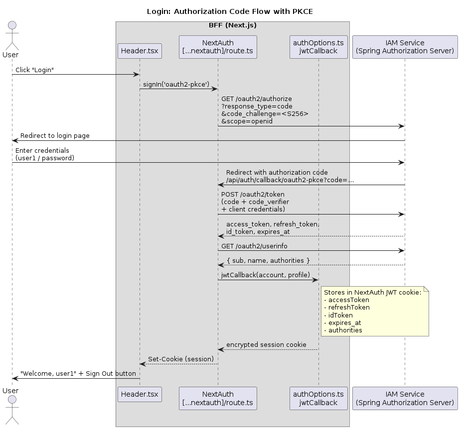
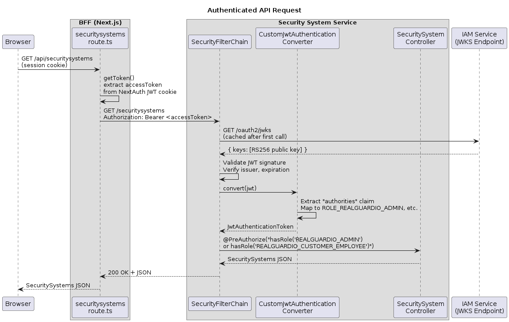
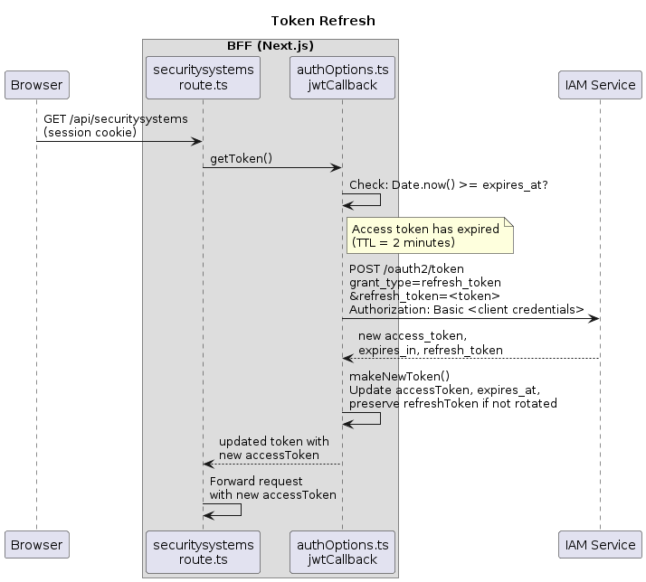
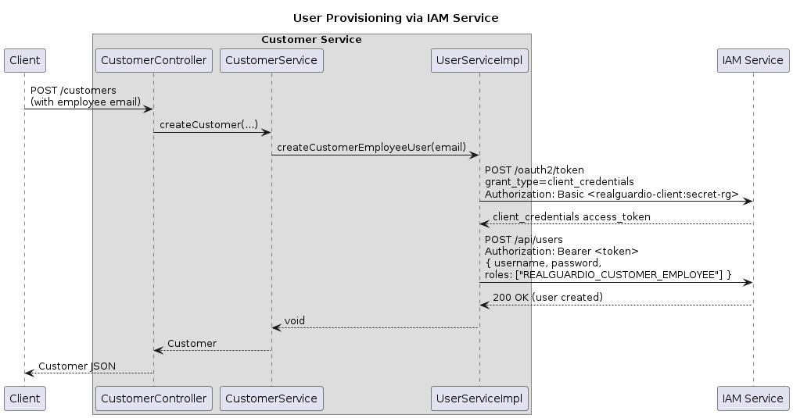

# Code Guide: Authentication in a Microservice Architecture

This guide helps readers of the article [Authentication in a Microservice Architecture](https://microservices.io/post/architecture/2025/05/28/microservices-authn-authz-part-2-authentication.html) navigate the RealGuardIO example codebase.

Note: this guide was generated by Claude Code using the following [prompt](article-prompts/part-2-prompt.md).

## Overview

The article explains how to implement authentication in a microservice architecture by centralizing it in a dedicated IAM service rather than distributing authentication logic across backend services.
The application uses the OAuth 2.0 Authorization Code Flow with PKCE, where a Next.js Backend for Frontend (BFF) acts as the OAuth 2.0 client, and backend Spring Boot services validate JWTs as OAuth 2.0 resource servers.

This guide maps these concepts to the services, modules within those services, the classes and configuration files within those modules, and the collaboration patterns between them.

## Key Components

The key components of the authentication feature are:

* **IAM Service** - An infrastructure service built on Spring Authorization Server that centralizes authentication
  * Issues OAuth 2.0 access tokens, ID tokens, and refresh tokens
  * Provides OIDC endpoints: authorization, token, userinfo, JWKS, and discovery
  * Manages user credentials and roles (with `UserDatabase` profile)
* **BFF (Next.js)** - A Backend for Frontend that acts as the OAuth 2.0 client
  * Initiates the Authorization Code Flow with PKCE on behalf of the user
  * Stores tokens in an encrypted NextAuth session cookie
  * Proxies API requests to backend services, forwarding the access token as a `Bearer` header
  * Handles transparent token refresh when access tokens expire
* **Security System Service** - A microservice that validates JWTs as an OAuth 2.0 resource server
  * Validates JWT signatures using cached public keys from the IAM Service's JWKS endpoint
  * Extracts the custom `authorities` claim to map user roles to Spring Security granted authorities
  * Enforces role-based access control on REST endpoints using `@PreAuthorize`
* **Customer Service** - A microservice that validates JWTs as an OAuth 2.0 resource server
  * Validates JWTs using the same mechanism as the Security System Service
  * Provisions new users in the IAM Service using the `client_credentials` grant type

## IAM Service

The IAM Service is built on Spring Authorization Server, packaged as a Docker image with a custom configuration.
It acts as the centralized identity provider for the entire application.

### Dockerfile

**[Dockerfile](../../realguardio-iam-service/Dockerfile)** - builds from an Eventuate Spring Authorization Server base image:

```dockerfile
FROM eventuateio/eventuate-examples-spring-authorization-server:0.1.0.BUILD-SNAPSHOT
COPY application.yaml application-realguardio.yaml
```

### OAuth 2.0 client registration

**[application.yaml](../../realguardio-iam-service/application.yaml)** - registers the `realguardio-client` used by the BFF:

```yaml
spring:
  security:
    user:
      name: user1
      password: password
      roles: USER,ADMIN,REALGUARDIO_ADMIN
    oauth2:
      authorizationserver:
        client:
          realguardio-client:
            token:
              access-token-time-to-live: 2m
              refresh-token-time-to-live: 60m
            registration:
              client-id: "realguardio-client"
              client-secret: "{noop}secret-rg"
              client-authentication-methods:
                - "client_secret_basic"
              authorization-grant-types:
                - "authorization_code"
                - "refresh_token"
                - "client_credentials"
                - "password"
              redirect-uris:
                - "http://localhost:3000/api/auth/callback/oauth2-pkce"
              scopes:
                - "openid"
                - "profile"
                - "email"
            require-proof-key: true
```

The configuration defines:
- A hardcoded user (`user1`) with roles including `REALGUARDIO_ADMIN`
- A registered OAuth 2.0 client supporting authorization code (with PKCE required), refresh token, and client credentials grant types
- Short-lived access tokens (2 minutes) and longer-lived refresh tokens (60 minutes)
- A redirect URI pointing to the BFF's NextAuth callback endpoint

When the `UserDatabase` profile is active, the IAM Service also exposes `POST /api/users` for programmatic user creation.

## BFF (Next.js)

The BFF is a Next.js application that uses NextAuth (next-auth v4) to manage the OAuth 2.0 authentication flow.
It acts as the OAuth 2.0 client, keeping tokens server-side and forwarding them to backend services.

### OAuth 2.0 provider configuration

**[authOptions.ts](../../realguardio-bff/authOptions.ts)** - configures the OAuth 2.0 provider with PKCE:

```typescript
providers: [
  {
    id: 'oauth2-pkce',
    name: 'OAuth2 PKCE Provider',
    type: 'oauth',
    clientId: process.env.OAUTH_CLIENT_ID,
    clientSecret: process.env.OAUTH_CLIENT_SECRET,
    token: process.env.OAUTH_TOKEN_URL,
    userinfo: process.env.OAUTH_USER_INFO_URL,
    issuer: process.env.OAUTH_ISSUER_URL,
    authorization: {
      url: process.env.OAUTH_AUTHORIZATION_URL,
      params: {
        scope: 'openid',
        response_type: 'code',
        code_challenge_method: 'S256',
      },
    },
    checks: ['pkce', 'state'],
    ...
  },
],
session: {
  strategy: 'jwt',
},
```

The `checks: ['pkce', 'state']` tells NextAuth to generate a PKCE code verifier/challenge pair and a state parameter for each authorization request.
The session strategy is `jwt`, meaning NextAuth stores the session in an encrypted cookie rather than a server-side database.

### Storing tokens in the session

**[authOptions.ts](../../realguardio-bff/authOptions.ts)** - the `jwtCallback` stores tokens from the initial login and user authorities from the OIDC profile:

```typescript
async function jwtCallback({ token, user, account, profile }) {
  if (account) {
    token.accessToken = account.access_token;
    token.refreshToken = account.refresh_token;
    token.idToken = account.id_token;
    token.expires_at = account.expires_at;
  }
  if (profile) {
    token.authorities = profile.authorities;
  }
  if (!account && !(Date.now() < token.expires_at * 1000)) {
    return await refreshToken(token);
  }
  return token;
}
```

On the initial login, the callback stores the access, refresh, and ID tokens along with the expiration timestamp.
On subsequent requests, it checks whether the access token has expired and triggers a refresh if needed.

### Token refresh

**[authOptions.ts](../../realguardio-bff/authOptions.ts)** - the `refreshToken` function exchanges a refresh token for a new access token:

```typescript
async function fetchNewTokens(refreshToken: string) {
  return await fetch(process.env.OAUTH_TOKEN_URL, {
    headers: {
      "Authorization": `Basic ${Buffer.from(
        `${process.env.OAUTH_CLIENT_ID}:${process.env.OAUTH_CLIENT_SECRET}`
      ).toString('base64')}`,
      "Content-Type": "application/x-www-form-urlencoded"
    },
    method: "POST",
    body: new URLSearchParams({
      grant_type: "refresh_token",
      refresh_token: refreshToken,
    }),
  });
}
```

The BFF sends the refresh token to the IAM Service's token endpoint with Basic authentication (client ID and secret).
The new access token and expiration are stored in the NextAuth JWT cookie, transparently extending the user's session.

### Proxying API requests with the access token

**[route.ts](../../realguardio-bff/app/api/securitysystems/route.ts)** - the server-side API route extracts the access token and forwards it to the backend:

```typescript
export async function GET() {
  const session = await getServerSession(authOptions);
  if (!session) {
    return NextResponse.json({ error: "Unauthorized" }, { status: 401 });
  }

  const req = { headers: await headers(), cookies: await cookies() };
  const token = await getToken({ req, secret: process.env.NEXTAUTH_SECRET });
  const { accessToken } = token;

  const response = await axios.get(`${securitySystemsApiUrl}/securitysystems`, {
    headers: { 'Authorization': `Bearer ${accessToken}` },
  });
  return NextResponse.json(response.data);
}
```

The route validates the session, extracts the access token from the encrypted NextAuth cookie, and includes it as a `Bearer` token in the `Authorization` header when calling the Security System Service.

### UI: login and role-based rendering

**[Header.tsx](../../realguardio-bff/components/Header.tsx)** - initiates login by calling `signIn('oauth2-pkce')`:

```tsx
const { data: session, status } = useSession();

// When not authenticated:
<button onClick={() => signIn('oauth2-pkce')}>Login</button>

// When authenticated:
<span>Welcome, {session?.user?.name}</span>
<button onClick={() => signOut()}>Sign Out</button>
```

**[VisibleInRole.tsx](../../realguardio-bff/components/VisibleInRole.tsx)** - conditionally renders content based on user roles from the session:

```tsx
export default function VisibleInRole({ requiredRole, children }) {
  const { data: session } = useSession();
  if (!session?.authorities) return null;
  const hasRole = session.authorities.includes(requiredRole);
  return hasRole ? <>{children}</> : null;
}
```

The `sessionCallback` in `authOptions.ts` exposes the `authorities` array (from the OIDC profile) on the client-side session, enabling role-based UI rendering without additional API calls.

### Environment configuration

**[template-dotenv-local](../../realguardio-bff/template-dotenv-local)** - defines the OAuth 2.0 endpoints for the BFF:

```env
OAUTH_CLIENT_ID=realguardio-client
OAUTH_CLIENT_SECRET=secret-rg
OAUTH_AUTHORIZATION_URL=http://localhost:9000/oauth2/authorize
OAUTH_TOKEN_URL=http://localhost:9000/oauth2/token
OAUTH_USER_INFO_URL=http://localhost:9000/oauth2/userinfo
OAUTH_ISSUER_URL=http://localhost:9000
OAUTH_JWKS_URL=http://localhost:9000/oauth2/jwks
NEXTAUTH_URL=http://localhost:3000
NEXTAUTH_SECRET=dummy_secret_key_for_testing_purposes_only
```

### NextAuth route handler

**[route.ts](../../realguardio-bff/app/api/auth/[...nextauth]/route.ts)** - mounts NextAuth as an API route in the Next.js App Router:

```typescript
import NextAuth from 'next-auth';
import { authOptions } from '@/authOptions';

const handler = NextAuth(authOptions);
export const GET = handler;
export const POST = handler;
```

## Security System Service

The Security System Service validates incoming JWTs as an OAuth 2.0 resource server.
It uses Spring Security's `oauth2ResourceServer` support to verify JWT signatures and extract user authorities.

### Inbound adapter: JWT validation and role mapping

The `security-system-service-restapi` module handles HTTP requests and JWT-based security.

**[SecurityConfig.java](../../realguardio-security-system-service/security-system-service-restapi/src/main/java/io/eventuate/examples/realguardio/securitysystemservice/restapi/SecurityConfig.java)** - configures the security filter chain as an OAuth 2.0 resource server:

```java
@Configuration
@EnableWebSecurity
@EnableMethodSecurity
public class SecurityConfig {

    private final CustomJwtAuthenticationConverter customJwtAuthenticationConverter;

    @Bean
    public SecurityFilterChain securityFilterChain(HttpSecurity http) throws Exception {
        http
            .csrf(csrf -> csrf.disable())
            .authorizeHttpRequests(authorize -> authorize
                .requestMatchers("/actuator/**").permitAll()
                .anyRequest().authenticated()
            )
            .oauth2ResourceServer(oauth2 -> oauth2
                .jwt(jwt -> jwt.jwtAuthenticationConverter(customJwtAuthenticationConverter))
            )
            .sessionManagement(session -> session
                .sessionCreationPolicy(SessionCreationPolicy.STATELESS)
            );
        return http.build();
    }
}
```

The configuration requires authentication for all endpoints except actuator health checks.
It uses a custom JWT authentication converter and stateless session management (no server-side sessions).

**[CustomJwtAuthenticationConverter.java](../../realguardio-security-system-service/security-system-service-restapi/src/main/java/io/eventuate/examples/realguardio/securitysystemservice/restapi/CustomJwtAuthenticationConverter.java)** - extracts the `authorities` claim from the JWT and maps each value to a `ROLE_` prefixed granted authority:

```java
@Component
public class CustomJwtAuthenticationConverter
        implements Converter<Jwt, AbstractAuthenticationToken> {

    @Override
    public AbstractAuthenticationToken convert(Jwt jwt) {
        Collection<GrantedAuthority> authorities = extractAuthorities(jwt);
        return new JwtAuthenticationToken(jwt, authorities);
    }

    private Collection<GrantedAuthority> extractAuthorities(Jwt jwt) {
        List<String> authoritiesClaim = jwt.getClaimAsStringList("authorities");
        if (authoritiesClaim == null) {
            return Collections.emptyList();
        }
        return authoritiesClaim.stream()
                .map(authority -> new SimpleGrantedAuthority("ROLE_" + authority))
                .collect(Collectors.toList());
    }
}
```

The IAM Service includes a custom `authorities` claim in the JWT containing roles like `REALGUARDIO_ADMIN`.
This converter maps them to Spring Security authorities `ROLE_REALGUARDIO_ADMIN`, enabling `@PreAuthorize("hasRole('REALGUARDIO_ADMIN')")` checks.

**[SecuritySystemController.java](../../realguardio-security-system-service/security-system-service-restapi/src/main/java/io/eventuate/examples/realguardio/securitysystemservice/restapi/SecuritySystemController.java)** - enforces role-based access on REST endpoints:

```java
@RestController
public class SecuritySystemController {

    @GetMapping("/securitysystems")
    @PreAuthorize("hasRole('REALGUARDIO_ADMIN') or hasRole('REALGUARDIO_CUSTOMER_EMPLOYEE')")
    public SecuritySystems getSecuritySystems() {
        return new SecuritySystems(securitySystemService.findAll());
    }
}
```

### Domain: JWT propagation for service-to-service calls

The `security-system-service-domain` module defines a port for extracting the current user's JWT so it can be forwarded to downstream services.

**[JwtProvider.java](../../realguardio-security-system-service/security-system-service-domain/src/main/java/io/eventuate/examples/realguardio/securitysystemservice/domain/JwtProvider.java)** - the port interface:

```java
public interface JwtProvider {
    String getCurrentJwtToken();
}
```

**[JwtProviderImpl.java](../../realguardio-security-system-service/security-system-service-domain/src/main/java/io/eventuate/examples/realguardio/securitysystemservice/domain/JwtProviderImpl.java)** - extracts the JWT from Spring Security's `SecurityContextHolder`:

```java
@Component
public class JwtProviderImpl implements JwtProvider {

    @Override
    public String getCurrentJwtToken() {
        Authentication authentication = SecurityContextHolder.getContext().getAuthentication();
        Jwt jwt = (Jwt) authentication.getPrincipal();
        return "Bearer " + jwt.getTokenValue();
    }
}
```

This enables the Security System Service to propagate the user's JWT when calling other services (e.g., the Customer Service), maintaining the authentication context across service boundaries.

### Resource server configuration

**[application.properties](../../realguardio-security-system-service/security-system-service-main/src/main/resources/application.properties)** - configures the JWKS and issuer URIs:

```properties
spring.security.oauth2.resourceserver.jwt.jwk-set-uri=http://localhost:9000/oauth2/jwks
spring.security.oauth2.resourceserver.jwt.issuer-uri=http://localhost:9000
```

Spring Security fetches and caches the public keys from the JWKS endpoint at startup, then uses them to validate JWT signatures on each request.

## Customer Service

The Customer Service validates JWTs using the same resource server mechanism as the Security System Service.
It also integrates with the IAM Service to provision new users.

### Inbound adapter: JWT validation

The `customer-service-restapi` module uses a slightly different approach to map JWT authorities - an inline lambda rather than a separate `@Component` class.

**[SecurityConfig.java](../../realguardio-customer-service/customer-service-restapi/src/main/java/io/eventuate/examples/realguardio/customerservice/restapi/SecurityConfig.java)** - configures JWT validation with an inline authorities converter:

```java
@Bean
public JwtAuthenticationConverter jwtAuthenticationConverter() {
    JwtAuthenticationConverter jwtConverter = new JwtAuthenticationConverter();
    jwtConverter.setJwtGrantedAuthoritiesConverter(jwt -> {
        List<String> roles = jwt.getClaim("authorities");
        return roles != null ? roles.stream()
            .map(role -> new SimpleGrantedAuthority("ROLE_" + role))
            .collect(Collectors.toList())
            : null;
    });
    return jwtConverter;
}
```

### Outbound adapter: IAM user provisioning

The `customer-service-iam-integration` module provisions user accounts in the IAM Service when new customer employees are created.

**[UserService.java](../../realguardio-customer-service/customer-service-domain/src/main/java/io/eventuate/examples/realguardio/customerservice/security/UserService.java)** - the port interface in the domain module:

```java
public interface UserService {
    void createCustomerEmployeeUser(String email);
}
```

**[UserServiceImpl.java](../../realguardio-customer-service/customer-service-iam-integration/src/main/java/io/eventuate/examples/realguardio/customerservice/iamintegration/UserServiceImpl.java)** - obtains a client credentials token and creates the user:

```java
public class UserServiceImpl implements UserService {

    @Value("${spring.security.oauth2.resourceserver.jwt.issuer-uri}")
    private String iamServiceBaseUrl;

    public void createCustomerEmployeeUser(String email) {
        var clientToken = getClientCredentialsJwt();
        webClient.post()
            .uri(iamServiceBaseUrl + "/api/users")
            .header("Authorization", "Bearer " + clientToken)
            .bodyValue("""
                {
                    "username": "%s",
                    "password": "{noop}password",
                    "roles": ["REALGUARDIO_CUSTOMER_EMPLOYEE"],
                    ...
                }
                """.formatted(email))
            .retrieve().bodyToMono(...).block();
    }

    public String getClientCredentialsJwt() {
        MultiValueMap<String, String> formData = new LinkedMultiValueMap<>();
        formData.add("grant_type", "client_credentials");
        formData.add("scope", "message.read message.write");
        Map<String, Object> tokenResponse = webClient.post()
            .uri(iamServiceBaseUrl + "/oauth2/token")
            .header("Authorization", "Basic " + encodedAuth)
            .body(BodyInserters.fromFormData(formData))
            .retrieve().bodyToMono(...).block();
        return (String) tokenResponse.get("access_token");
    }
}
```

This demonstrates service-to-service authentication using the `client_credentials` grant type.
The Customer Service authenticates itself (not a user) to the IAM Service, then uses the resulting token to call the user management API.

## Service Collaboration

### Login: Authorization Code Flow with PKCE

When a user clicks "Login", the BFF initiates the OAuth 2.0 Authorization Code Flow with PKCE, redirecting the user to the IAM Service for authentication.



<!-- Source: diagrams/part-2/login-authorization-code-flow.txt (PlantUML) -->

1. **User clicks Login** - [Header.tsx](../../realguardio-bff/components/Header.tsx) calls `signIn('oauth2-pkce')`, which triggers NextAuth to redirect to the IAM Service's `/oauth2/authorize` endpoint with a PKCE code challenge (S256) and state parameter.
2. **User authenticates** - The IAM Service presents a login form. The user enters credentials (e.g., `user1` / `password`), and the IAM Service validates them.
3. **Authorization code returned** - The IAM Service redirects back to the BFF's callback URL (`/api/auth/callback/oauth2-pkce`) with an authorization code.
4. **Token exchange** - The NextAuth handler in [route.ts](../../realguardio-bff/app/api/auth/[...nextauth]/route.ts) exchanges the authorization code and PKCE code verifier for an access token, refresh token, and ID token by calling `POST /oauth2/token`.
5. **UserInfo fetched** - NextAuth calls the IAM Service's `/oauth2/userinfo` endpoint to retrieve the user's profile, including the custom `authorities` array.
6. **Session created** - The `jwtCallback` in [authOptions.ts](../../realguardio-bff/authOptions.ts) stores the tokens and authorities in an encrypted NextAuth JWT cookie, which is sent to the browser.

### Authenticated API Request

When an authenticated user requests data, the BFF extracts the access token from the session and forwards it to the backend service, which validates the JWT using cached JWKS public keys.



<!-- Source: diagrams/part-2/authenticated-api-request.txt (PlantUML) -->

1. **Browser sends request** - The browser calls `GET /api/securitysystems` with the NextAuth session cookie.
2. **BFF extracts token** - [route.ts](../../realguardio-bff/app/api/securitysystems/route.ts) validates the session via `getServerSession()`, then extracts the `accessToken` from the encrypted cookie using `getToken()`.
3. **BFF forwards request** - The route calls the Security System Service's `GET /securitysystems` endpoint with `Authorization: Bearer <accessToken>`.
4. **JWT signature validation** - Spring Security's `SecurityFilterChain` validates the JWT signature using the public key fetched (and cached) from the IAM Service's JWKS endpoint (`/oauth2/jwks`).
5. **Authorities extraction** - [CustomJwtAuthenticationConverter.java](../../realguardio-security-system-service/security-system-service-restapi/src/main/java/io/eventuate/examples/realguardio/securitysystemservice/restapi/CustomJwtAuthenticationConverter.java) reads the `authorities` claim and maps each to `ROLE_<authority>`.
6. **Role-based access control** - [SecuritySystemController.java](../../realguardio-security-system-service/security-system-service-restapi/src/main/java/io/eventuate/examples/realguardio/securitysystemservice/restapi/SecuritySystemController.java) enforces `@PreAuthorize("hasRole('REALGUARDIO_ADMIN') or hasRole('REALGUARDIO_CUSTOMER_EMPLOYEE')")` and returns the data.

### Token Refresh

When the access token expires (after 2 minutes), the BFF transparently refreshes it using the refresh token before forwarding the request.



<!-- Source: diagrams/part-2/token-refresh.txt (PlantUML) -->

1. **Browser sends request** - The browser calls an API route with the session cookie.
2. **Expiration check** - The `jwtCallback` in [authOptions.ts](../../realguardio-bff/authOptions.ts) detects that `Date.now() >= token.expires_at * 1000`.
3. **Refresh token exchange** - The `fetchNewTokens()` function sends `POST /oauth2/token` with `grant_type=refresh_token` and Basic authentication to the IAM Service.
4. **New tokens stored** - The `makeNewToken()` function updates the `accessToken` and `expires_at` in the NextAuth JWT cookie. If the IAM Service does not return a new refresh token, the existing one is preserved.

### User Provisioning via IAM Service

When a new customer employee is created, the Customer Service provisions a corresponding user account in the IAM Service using service-to-service authentication.



<!-- Source: diagrams/part-2/user-provisioning.txt (PlantUML) -->

1. **Client creates customer** - A request arrives at the Customer Service to create a customer with an employee email.
2. **Service obtains client credentials token** - [UserServiceImpl.java](../../realguardio-customer-service/customer-service-iam-integration/src/main/java/io/eventuate/examples/realguardio/customerservice/iamintegration/UserServiceImpl.java) calls `POST /oauth2/token` with `grant_type=client_credentials` and Basic authentication to obtain a service-level access token.
3. **Service creates user** - Using the client credentials token, `UserServiceImpl` calls `POST /api/users` on the IAM Service to create a user with the `REALGUARDIO_CUSTOMER_EMPLOYEE` role.

## Project Structure

| Service | Module | Architectural Role | Key Files |
|---------|--------|--------------------|-----------|
| IAM | [realguardio-iam-service](../../realguardio-iam-service) | Infrastructure service (Spring Authorization Server) | [Dockerfile](../../realguardio-iam-service/Dockerfile), [application.yaml](../../realguardio-iam-service/application.yaml) |
| BFF | [realguardio-bff](../../realguardio-bff) | OAuth 2.0 client + API proxy | [authOptions.ts](../../realguardio-bff/authOptions.ts), [route.ts](../../realguardio-bff/app/api/auth/[...nextauth]/route.ts), [route.ts](../../realguardio-bff/app/api/securitysystems/route.ts) |
| BFF | [components](../../realguardio-bff/components) | UI (login, role-based rendering) | [Header.tsx](../../realguardio-bff/components/Header.tsx), [VisibleInRole.tsx](../../realguardio-bff/components/VisibleInRole.tsx) |
| Security System | [security-system-service-restapi](../../realguardio-security-system-service/security-system-service-restapi/src/main/java/io/eventuate/examples/realguardio/securitysystemservice/restapi) | Inbound adapter (JWT validation + role mapping) | [SecurityConfig.java](../../realguardio-security-system-service/security-system-service-restapi/src/main/java/io/eventuate/examples/realguardio/securitysystemservice/restapi/SecurityConfig.java), [CustomJwtAuthenticationConverter.java](../../realguardio-security-system-service/security-system-service-restapi/src/main/java/io/eventuate/examples/realguardio/securitysystemservice/restapi/CustomJwtAuthenticationConverter.java), [SecuritySystemController.java](../../realguardio-security-system-service/security-system-service-restapi/src/main/java/io/eventuate/examples/realguardio/securitysystemservice/restapi/SecuritySystemController.java) |
| Security System | [security-system-service-domain](../../realguardio-security-system-service/security-system-service-domain/src/main/java/io/eventuate/examples/realguardio/securitysystemservice/domain) | Domain (JWT propagation port) | [JwtProvider.java](../../realguardio-security-system-service/security-system-service-domain/src/main/java/io/eventuate/examples/realguardio/securitysystemservice/domain/JwtProvider.java), [JwtProviderImpl.java](../../realguardio-security-system-service/security-system-service-domain/src/main/java/io/eventuate/examples/realguardio/securitysystemservice/domain/JwtProviderImpl.java) |
| Customer | [customer-service-restapi](../../realguardio-customer-service/customer-service-restapi/src/main/java/io/eventuate/examples/realguardio/customerservice/restapi) | Inbound adapter (JWT validation) | [SecurityConfig.java](../../realguardio-customer-service/customer-service-restapi/src/main/java/io/eventuate/examples/realguardio/customerservice/restapi/SecurityConfig.java) |
| Customer | [customer-service-domain](../../realguardio-customer-service/customer-service-domain/src/main/java/io/eventuate/examples/realguardio/customerservice/security) | Domain (user provisioning port) | [UserService.java](../../realguardio-customer-service/customer-service-domain/src/main/java/io/eventuate/examples/realguardio/customerservice/security/UserService.java) |
| Customer | [customer-service-iam-integration](../../realguardio-customer-service/customer-service-iam-integration/src/main/java/io/eventuate/examples/realguardio/customerservice/iamintegration) | Outbound adapter (IAM user provisioning) | [UserServiceImpl.java](../../realguardio-customer-service/customer-service-iam-integration/src/main/java/io/eventuate/examples/realguardio/customerservice/iamintegration/UserServiceImpl.java) |
