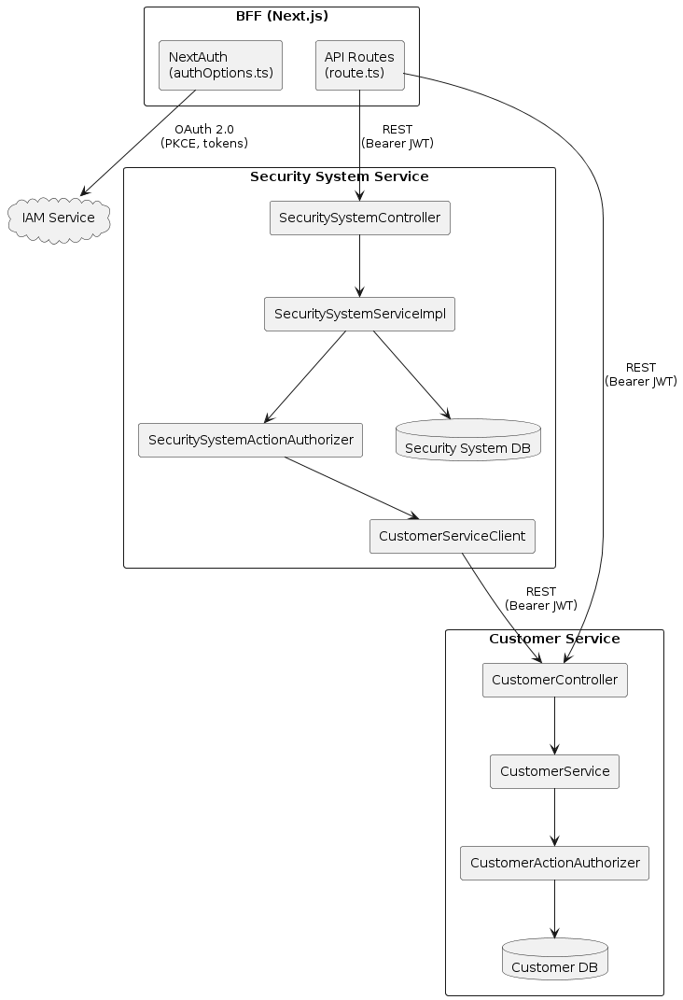
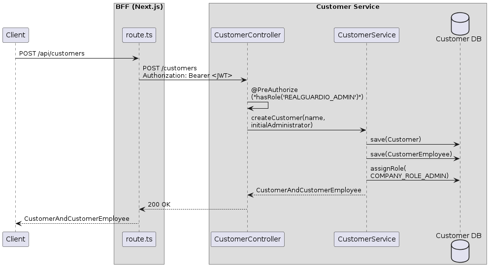
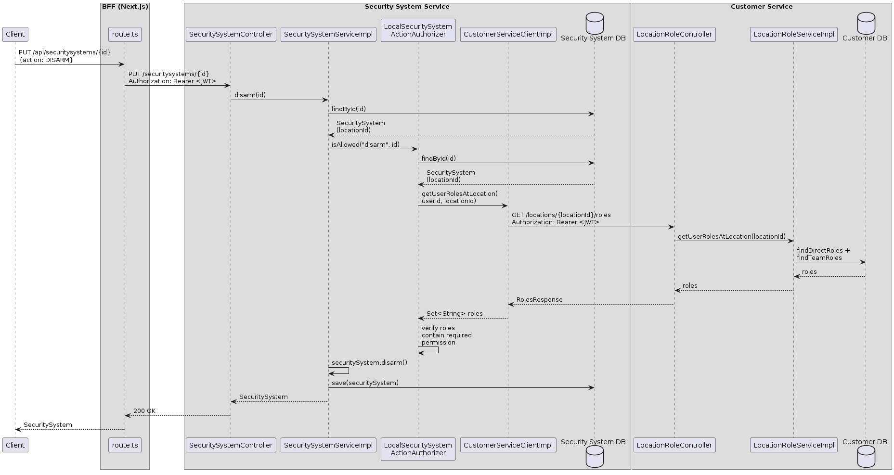

# Code Guide: Implementing JWT-Based Authorization

This guide helps readers of the article [Implementing JWT-based authorization](https://microservices.io/post/architecture/2025/07/22/microservices-authn-authz-part-3-jwt-authorization.html) navigate the RealGuardIO example codebase.

Note: this guide was generated by Claude Code using the following [prompt](article-prompts/part-3-prompt.md).

## Overview

The article explains how services can use JWT-based access tokens to implement authorization.
It introduces three categories of authorization data — built-in (user identity and roles from the IAM Service), local (data the service owns), and remote (data owned by other services) — and describes four strategies for obtaining remote data: Provide (embed in JWT), Fetch, Replicate, and Delegate.

This guide maps those concepts to the RealGuardIO codebase, showing how each service extracts the `authorities` claim from the JWT to implement role-based access control, how domain-level authorization uses roles-to-permissions mappings, and how the Security System Service fetches remote authorization data from the Customer Service when JWT claims alone are insufficient.

## Key Components

The following diagram shows the key components of the JWT-based authorization feature.



<!-- Source: diagrams/part-3/key-components.txt (PlantUML) -->

The responsibilities of each component are as follows:

* **IAM Service** - An infrastructure service that issues JWTs containing an `authorities` claim
  * Embeds user roles (e.g., `REALGUARDIO_ADMIN`, `REALGUARDIO_CUSTOMER_EMPLOYEE`) as a custom `authorities` claim in the JWT payload
  * This is the "Provide" strategy: coarse-grained role data is included directly in the token
* **BFF (Next.js)** - A Backend for Frontend that forwards JWTs to backend services
  * Extracts the access token from the NextAuth session cookie and includes it as a `Bearer` header when calling backend services
* **Customer Service** - A microservice that uses JWT roles for coarse-grained access control and local data for fine-grained authorization
  * Validates JWTs and maps the `authorities` claim to Spring Security granted authorities
  * Uses `@PreAuthorize` for coarse-grained role checks (built-in data)
  * Uses `CustomerActionAuthorizer` for fine-grained permission checks against locally owned data
  * Exposes `GET /locations/{locationId}/roles` for other services to fetch authorization data
* **Security System Service** - A microservice that combines JWT roles with remote authorization data
  * Validates JWTs and maps the `authorities` claim to Spring Security granted authorities
  * Uses `@PreAuthorize` for coarse-grained role checks (built-in data)
  * Uses `SecuritySystemActionAuthorizer` for fine-grained permission checks, which must fetch remote data from the Customer Service because the roles-at-location data is not available in the JWT

## IAM Service

The IAM Service embeds role information in the JWT, implementing the article's "Provide" strategy.

### JWT authorities claim

**[application.yaml](../../realguardio-iam-service/application.yaml)** - configures the user with roles that become the JWT `authorities` claim:

```yaml
spring:
  security:
    user:
      name: user1
      password: password
      roles: USER,ADMIN,REALGUARDIO_ADMIN
```

The roles `REALGUARDIO_ADMIN` and `REALGUARDIO_CUSTOMER_EMPLOYEE` appear as the `authorities` claim in the JWT payload.
These are coarse-grained roles suitable for initial access control decisions, but they cannot encode fine-grained relationships like "which locations can this user manage?"

## Customer Service

The Customer Service uses two layers of authorization: coarse-grained `@PreAuthorize` checks using the JWT's built-in roles, and fine-grained `CustomerActionAuthorizer` checks using locally owned data.

### Inbound adapter: JWT validation and role-based access control

The `customer-service-restapi` module handles JWT validation and coarse-grained authorization.

**[SecurityConfig.java](../../realguardio-customer-service/customer-service-restapi/src/main/java/io/eventuate/examples/realguardio/customerservice/restapi/SecurityConfig.java)** - configures JWT validation with an inline authorities converter:

```java
@Bean
public JwtAuthenticationConverter jwtAuthenticationConverter() {
    JwtAuthenticationConverter jwtConverter = new JwtAuthenticationConverter();
    jwtConverter.setJwtGrantedAuthoritiesConverter(jwt -> {
        List<String> roles = jwt.getClaim("authorities");
        return roles != null ? roles.stream()
            .map(role -> new SimpleGrantedAuthority("ROLE_" + role))
            .collect(Collectors.toList())
            : null;
    });
    return jwtConverter;
}
```

The converter reads the `authorities` claim and maps each value to a `ROLE_` prefixed Spring Security granted authority, enabling `@PreAuthorize` checks.

**[CustomerController.java](../../realguardio-customer-service/customer-service-restapi/src/main/java/io/eventuate/examples/realguardio/customerservice/restapi/CustomerController.java)** - uses `@PreAuthorize` for coarse-grained role checks (built-in data from the JWT):

```java
@PostMapping
@PreAuthorize("hasRole('REALGUARDIO_ADMIN')")
public CustomerAndCustomerEmployee createCustomer(@RequestBody CreateCustomerRequest request) {
    return customerService.createCustomer(request.name(), request.initialAdministrator());
}

@PostMapping("/{customerId}/employees")
@PreAuthorize("hasRole('REALGUARDIO_CUSTOMER_EMPLOYEE')")
public CustomerEmployee createEmployee(@PathVariable Long customerId, ...) {
    return customerService.createCustomerEmployee(customerId, request.personDetails());
}
```

Creating a customer requires the `REALGUARDIO_ADMIN` role.
Creating an employee requires the `REALGUARDIO_CUSTOMER_EMPLOYEE` role — but the controller also delegates to `CustomerActionAuthorizer` for fine-grained checks.

### Domain: fine-grained authorization using local data

The `customer-service-domain` module implements fine-grained authorization using locally owned data.

**[RolesAndPermissions.java](../../realguardio-customer-service/customer-service-domain/src/main/java/io/eventuate/examples/realguardio/customerservice/customermanagement/domain/RolesAndPermissions.java)** - maps roles to permissions:

```java
public static final Map<String, Set<String>> rolesToPermissions = Map.of(
    Roles.COMPANY_ROLE_ADMIN, Set.of(
        Permissions.CREATE_CUSTOMER_EMPLOYEE,
        Permissions.CREATE_LOCATION)
);
```

Only a `COMPANY_ROLE_ADMIN` within a specific customer can create employees or locations.
This role-to-permission mapping cannot be encoded in the JWT because it is tied to the specific customer relationship.

**[CustomerActionAuthorizer.java](../../realguardio-customer-service/customer-service-domain/src/main/java/io/eventuate/examples/realguardio/customerservice/customermanagement/domain/CustomerActionAuthorizer.java)** - the authorization port:

```java
public interface CustomerActionAuthorizer {
  void isAllowed(String permission, long customerId);
}
```

**[LocalCustomerActionAuthorizer.java](../../realguardio-customer-service/customer-service-domain/src/main/java/io/eventuate/examples/realguardio/customerservice/customermanagement/domain/LocalCustomerActionAuthorizer.java)** - verifies the user has the required role within the specified customer, using the local database:

```java
@Override
public void isAllowed(String permission, long customerId) {
    Set<String> requiredRoles = RolesAndPermissions.rolesForPermission(permission);
    ...
    verifyCustomerEmployeeHasRequiredRolesInCustomer(customerId, requiredRoles);
}

private void verifyCustomerEmployeeHasRequiredRolesInCustomer(Long customerId, Set<String> requiredRoles) {
    String userId = userNameSupplier.getCurrentUserEmail();
    Set<String> currentUserRolesAtCustomer = customerEmployeeRepository.findRolesInCustomer(customerId, userId);
    if (Collections.disjoint(currentUserRolesAtCustomer, requiredRoles)) {
        throw new NotAuthorizedException(...);
    }
}
```

This demonstrates the use of **local** authorization data: the Customer Service owns the employee-to-customer-role relationships and can query them directly without any cross-service calls.

### Inbound adapter: location roles endpoint (for the Fetch strategy)

The Customer Service also exposes an endpoint that allows other services to fetch authorization data.

**[LocationRoleController.java](../../realguardio-customer-service/customer-service-restapi/src/main/java/io/eventuate/examples/realguardio/customerservice/restapi/LocationRoleController.java)** - returns a user's roles at a specific location:

```java
@GetMapping("/locations/{locationId}/roles")
@PreAuthorize("hasRole('REALGUARDIO_CUSTOMER_EMPLOYEE') or hasRole('REALGUARDIO_ADMIN')")
public ResponseEntity<RolesResponse> getUserRolesAtLocation(
        @PathVariable("locationId") Long locationId) {
    Set<String> roles = locationRoleService.getUserRolesAtLocation(locationId);
    return ResponseEntity.ok(new RolesResponse(roles));
}
```

**[LocationRoleServiceImpl.java](../../realguardio-customer-service/customer-service-domain/src/main/java/io/eventuate/examples/realguardio/customerservice/customermanagement/domain/LocationRoleServiceImpl.java)** - combines direct and team-based roles:

```java
@Override
public Set<String> getUserRolesAtLocation(Long locationId) {
    String userName = userNameSupplier.getCurrentUserEmail();
    Set<String> allRoles = new HashSet<>();
    allRoles.addAll(findDirectRolesForEmployeeAtLocation(userName, locationId));
    allRoles.addAll(findTeamRolesForEmployeeAtLocation(userName, locationId));
    return allRoles;
}
```

This endpoint is used by the Security System Service's Fetch strategy (see below).

## Security System Service

The Security System Service uses the JWT's `authorities` claim for coarse-grained access control, but requires **remote** authorization data from the Customer Service for fine-grained decisions like "can this user disarm this security system?"

### Inbound adapter: JWT validation and role mapping

The `security-system-service-restapi` module handles JWT validation.

**[CustomJwtAuthenticationConverter.java](../../realguardio-security-system-service/security-system-service-restapi/src/main/java/io/eventuate/examples/realguardio/securitysystemservice/restapi/CustomJwtAuthenticationConverter.java)** - extracts the `authorities` claim:

```java
@Override
public AbstractAuthenticationToken convert(Jwt jwt) {
    Collection<GrantedAuthority> authorities = extractAuthorities(jwt);
    return new JwtAuthenticationToken(jwt, authorities);
}

private Collection<GrantedAuthority> extractAuthorities(Jwt jwt) {
    List<String> authoritiesClaim = jwt.getClaimAsStringList("authorities");
    if (authoritiesClaim == null) {
        return Collections.emptyList();
    }
    return authoritiesClaim.stream()
            .map(authority -> new SimpleGrantedAuthority("ROLE_" + authority))
            .collect(Collectors.toList());
}
```

**[SecuritySystemController.java](../../realguardio-security-system-service/security-system-service-restapi/src/main/java/io/eventuate/examples/realguardio/securitysystemservice/restapi/SecuritySystemController.java)** - uses `@PreAuthorize` for coarse-grained checks:

```java
@GetMapping("/securitysystems")
@PreAuthorize("hasRole('REALGUARDIO_ADMIN') or hasRole('REALGUARDIO_CUSTOMER_EMPLOYEE')")
public SecuritySystems getSecuritySystems() {
    return new SecuritySystems(securitySystemService.findAll());
}
```

The `@PreAuthorize` annotation uses the **built-in** JWT data.
But determining whether a specific customer employee can disarm a specific security system requires remote data.

### Domain: authorization using the roles-to-permissions model

The `security-system-service-domain` module defines the security system's roles and permissions.

**[RolesAndPermissions.java](../../realguardio-security-system-service/security-system-service-domain/src/main/java/io/eventuate/examples/realguardio/securitysystemservice/domain/RolesAndPermissions.java)** - maps location-level roles to security system permissions:

```java
public static final String SECURITY_SYSTEM_ARMER = "SECURITY_SYSTEM_ARMER";
public static final String SECURITY_SYSTEM_DISARMER = "SECURITY_SYSTEM_DISARMER";
public static final String SECURITY_SYSTEM_VIEWER = "SECURITY_SYSTEM_VIEWER";

public static final Map<String, Set<String>> rolesToPermissions = Map.of(
    SECURITY_SYSTEM_ARMER, Set.of(ARM, VIEW),
    SECURITY_SYSTEM_DISARMER, Set.of(DISARM, VIEW),
    SECURITY_SYSTEM_VIEWER, Set.of(VIEW)
);
```

These roles are assigned at the location level in the Customer Service, not in the JWT.
This is the article's key example of authorization data that **cannot** be embedded in the JWT because it involves relationships across services.

### Domain: business logic and SecuritySystemActionAuthorizer port

**[SecuritySystemServiceImpl.java](../../realguardio-security-system-service/security-system-service-domain/src/main/java/io/eventuate/examples/realguardio/securitysystemservice/domain/SecuritySystemServiceImpl.java)** - the domain service checks authorization before performing actions:

```java
@Override
public SecuritySystem disarm(Long id) {
    SecuritySystem securitySystem = securitySystemRepository.findById(id)
        .orElseThrow(() -> new NotFoundException("Security system not found: " + id));
    ...
    if (userNameSupplier.isCustomerEmployee())
        securitySystemActionAuthorizer.isAllowed(RolesAndPermissions.DISARM, id);

    securitySystem.disarm();
    return securitySystemRepository.save(securitySystem);
}
```

Admin users bypass fine-grained checks (their JWT `REALGUARDIO_ADMIN` role is sufficient).
Customer employees require fine-grained authorization via `SecuritySystemActionAuthorizer`.

**[SecuritySystemActionAuthorizer.java](../../realguardio-security-system-service/security-system-service-domain/src/main/java/io/eventuate/examples/realguardio/securitysystemservice/domain/SecuritySystemActionAuthorizer.java)** - the authorization port:

```java
public interface SecuritySystemActionAuthorizer {
  void isAllowed(String permission, long securitySystemId);
}
```

**[AbstractSecuritySystemActionAuthorizer.java](../../realguardio-security-system-service/security-system-service-domain/src/main/java/io/eventuate/examples/realguardio/securitysystemservice/domain/AbstractSecuritySystemActionAuthorizer.java)** - skips fine-grained checks for admin users:

```java
public void isAllowed(String permission, long securitySystemId) {
    if (userNameSupplier.isCustomerEmployee())
        isAllowedForCustomerEmployee(permission, securitySystemId);
}
```

### Domain: fetching remote authorization data

**[LocalSecuritySystemActionAuthorizer.java](../../realguardio-security-system-service/security-system-service-domain/src/main/java/io/eventuate/examples/realguardio/securitysystemservice/domain/LocalSecuritySystemActionAuthorizer.java)** - implements the Fetch strategy by calling the Customer Service:

```java
@Override
protected void isAllowedForCustomerEmployee(String permission, long securitySystemId) {
    Set<String> requiredRoles = RolesAndPermissions.rolesForPermission(permission);
    SecuritySystem securitySystem = securitySystemRepository.findById(securitySystemId)
        .orElseThrow(...);
    Long locationId = securitySystem.getLocationId();
    String userId = userNameSupplier.getCurrentUserName();

    Set<String> rolesAtLocation = customerServiceClient.getUserRolesAtLocation(userId, locationId);

    if (Collections.disjoint(rolesAtLocation, requiredRoles)) {
        throw new ForbiddenException(...);
    }
}
```

This is the article's key scenario: the security system's `locationId` is **local** data, but the user's roles at that location are **remote** data owned by the Customer Service.
The authorizer must fetch this data via `CustomerServiceClient`.

**[CustomerServiceClient.java](../../realguardio-security-system-service/security-system-service-domain/src/main/java/io/eventuate/examples/realguardio/securitysystemservice/domain/CustomerServiceClient.java)** - the port for accessing remote authorization data:

```java
public interface CustomerServiceClient {
    Set<String> getUserRolesAtLocation(String userId, Long locationId);
}
```

### Outbound adapter: HTTP-based fetch

The `security-system-service-customer-service-proxy` module implements the Fetch strategy via REST.

**[CustomerServiceClientImpl.java](../../realguardio-security-system-service/security-system-service-customer-service-proxy/src/main/java/io/eventuate/examples/realguardio/securitysystemservice/customerserviceproxy/CustomerServiceClientImpl.java)** - calls the Customer Service's REST API:

```java
@Component
@Profile("!UseRolesReplica")
public class CustomerServiceClientImpl implements CustomerServiceClient {
    ...
    @Override
    public Set<String> getUserRolesAtLocation(String userId, Long locationId) {
        String url = customerServiceUrl + "/locations/" + locationId + "/roles";
        HttpHeaders headers = new HttpHeaders();
        headers.set(HttpHeaders.AUTHORIZATION, jwtProvider.getCurrentJwtToken());

        ResponseEntity<RolesResponse> response = restTemplate.exchange(
            url, HttpMethod.GET, new HttpEntity<>(headers), RolesResponse.class);

        return response.getBody().getRoles();
    }
}
```

This implementation propagates the user's JWT to the Customer Service using `JwtProvider`, maintaining the authentication context across service boundaries.
The `@Profile("!UseRolesReplica")` annotation activates this implementation when the Replicate strategy is not enabled.

### JWT propagation port

**[JwtProvider.java](../../realguardio-security-system-service/security-system-service-domain/src/main/java/io/eventuate/examples/realguardio/securitysystemservice/domain/JwtProvider.java)** - the port for extracting the current user's JWT:

```java
public interface JwtProvider {
    String getCurrentJwtToken();
}
```

**[JwtProviderImpl.java](../../realguardio-security-system-service/security-system-service-domain/src/main/java/io/eventuate/examples/realguardio/securitysystemservice/domain/JwtProviderImpl.java)** - extracts the JWT from Spring Security's context:

```java
@Override
public String getCurrentJwtToken() {
    Authentication authentication = SecurityContextHolder.getContext().getAuthentication();
    ...
    Jwt jwt = (Jwt) authentication.getPrincipal();
    return "Bearer " + jwt.getTokenValue();
}
```

This enables the Security System Service to forward the user's JWT when fetching authorization data from the Customer Service.

### Identity extraction

**[UserNameSupplierImpl.java](../../realguardio-security-system-service/security-system-service-domain/src/main/java/io/eventuate/examples/realguardio/securitysystemservice/domain/UserNameSupplierImpl.java)** - extracts the user's identity and roles from the JWT:

```java
@Override
public String getCurrentUserName() {
    Authentication auth = SecurityContextHolder.getContext().getAuthentication();
    return auth.getName();
}

@Override
public boolean isCustomerEmployee() {
    return getCurrentUserRoles().contains("ROLE_REALGUARDIO_CUSTOMER_EMPLOYEE");
}
```

The `isCustomerEmployee()` method uses the **built-in** JWT data to determine whether fine-grained authorization is needed.
Admin users (`REALGUARDIO_ADMIN`) bypass the fine-grained checks entirely.

## Service Collaboration

### Creating a Customer (JWT roles only)

This scenario uses only the **built-in** JWT data: the `REALGUARDIO_ADMIN` role embedded in the `authorities` claim.
No remote data is needed.



<!-- Source: diagrams/part-3/create-customer.txt (PlantUML) -->

1. **Client sends request** - The BFF forwards `POST /customers` with the JWT as a `Bearer` token.
2. **Coarse-grained check** - [CustomerController.java](../../realguardio-customer-service/customer-service-restapi/src/main/java/io/eventuate/examples/realguardio/customerservice/restapi/CustomerController.java) enforces `@PreAuthorize("hasRole('REALGUARDIO_ADMIN')")` using the JWT's `authorities` claim.
3. **Business logic** - [CustomerService.java](../../realguardio-customer-service/customer-service-domain/src/main/java/io/eventuate/examples/realguardio/customerservice/customermanagement/domain/CustomerService.java) creates the customer, an initial administrator employee, and assigns the `COMPANY_ROLE_ADMIN` role.

### Disarming a Security System (JWT roles + remote data)

This scenario illustrates why JWT claims alone are insufficient.
The `REALGUARDIO_CUSTOMER_EMPLOYEE` role from the JWT grants access to the endpoint, but determining whether the user can **disarm** a specific security system requires the user's location-level role (e.g., `SECURITY_SYSTEM_DISARMER`), which is owned by the Customer Service.



<!-- Source: diagrams/part-3/disarm-security-system.txt (PlantUML) -->

1. **Coarse-grained check** - [SecuritySystemController.java](../../realguardio-security-system-service/security-system-service-restapi/src/main/java/io/eventuate/examples/realguardio/securitysystemservice/restapi/SecuritySystemController.java) enforces `@PreAuthorize("hasRole('REALGUARDIO_ADMIN') or hasRole('REALGUARDIO_CUSTOMER_EMPLOYEE')")` using the JWT's built-in `authorities` claim.
2. **Local data lookup** - [SecuritySystemServiceImpl.java](../../realguardio-security-system-service/security-system-service-domain/src/main/java/io/eventuate/examples/realguardio/securitysystemservice/domain/SecuritySystemServiceImpl.java) retrieves the security system from the local database to get its `locationId`.
3. **Fine-grained authorization** - [LocalSecuritySystemActionAuthorizer.java](../../realguardio-security-system-service/security-system-service-domain/src/main/java/io/eventuate/examples/realguardio/securitysystemservice/domain/LocalSecuritySystemActionAuthorizer.java) determines the required roles from `RolesAndPermissions`.
4. **Fetch remote data** - [CustomerServiceClientImpl.java](../../realguardio-security-system-service/security-system-service-customer-service-proxy/src/main/java/io/eventuate/examples/realguardio/securitysystemservice/customerserviceproxy/CustomerServiceClientImpl.java) calls the Customer Service's `GET /locations/{locationId}/roles` endpoint, forwarding the user's JWT.
5. **Customer Service responds** - [LocationRoleController.java](../../realguardio-customer-service/customer-service-restapi/src/main/java/io/eventuate/examples/realguardio/customerservice/restapi/LocationRoleController.java) returns the user's roles at the location (combining direct and team-based roles).
6. **Permission check** - The authorizer verifies the returned roles include `SECURITY_SYSTEM_DISARMER`.
7. **Action performed** - The security system's state is changed to `DISARMED`.

## Project Structure

| Service | Module | Architectural Role | Key Files |
|---------|--------|--------------------|-----------|
| IAM | [realguardio-iam-service](../../realguardio-iam-service) | Infrastructure service (JWT issuer) | [application.yaml](../../realguardio-iam-service/application.yaml) |
| Customer | [customer-service-restapi](../../realguardio-customer-service/customer-service-restapi/src/main/java/io/eventuate/examples/realguardio/customerservice/restapi) | Inbound adapter (JWT validation, role-based access, location roles endpoint) | [SecurityConfig.java](../../realguardio-customer-service/customer-service-restapi/src/main/java/io/eventuate/examples/realguardio/customerservice/restapi/SecurityConfig.java), [CustomerController.java](../../realguardio-customer-service/customer-service-restapi/src/main/java/io/eventuate/examples/realguardio/customerservice/restapi/CustomerController.java), [LocationRoleController.java](../../realguardio-customer-service/customer-service-restapi/src/main/java/io/eventuate/examples/realguardio/customerservice/restapi/LocationRoleController.java) |
| Customer | [customer-service-domain](../../realguardio-customer-service/customer-service-domain/src/main/java/io/eventuate/examples/realguardio/customerservice/customermanagement/domain) | Domain (local authorization, roles-permissions model) | [CustomerActionAuthorizer.java](../../realguardio-customer-service/customer-service-domain/src/main/java/io/eventuate/examples/realguardio/customerservice/customermanagement/domain/CustomerActionAuthorizer.java), [LocalCustomerActionAuthorizer.java](../../realguardio-customer-service/customer-service-domain/src/main/java/io/eventuate/examples/realguardio/customerservice/customermanagement/domain/LocalCustomerActionAuthorizer.java), [RolesAndPermissions.java](../../realguardio-customer-service/customer-service-domain/src/main/java/io/eventuate/examples/realguardio/customerservice/customermanagement/domain/RolesAndPermissions.java), [LocationRoleServiceImpl.java](../../realguardio-customer-service/customer-service-domain/src/main/java/io/eventuate/examples/realguardio/customerservice/customermanagement/domain/LocationRoleServiceImpl.java) |
| Security System | [security-system-service-restapi](../../realguardio-security-system-service/security-system-service-restapi/src/main/java/io/eventuate/examples/realguardio/securitysystemservice/restapi) | Inbound adapter (JWT validation, role mapping) | [SecurityConfig.java](../../realguardio-security-system-service/security-system-service-restapi/src/main/java/io/eventuate/examples/realguardio/securitysystemservice/restapi/SecurityConfig.java), [CustomJwtAuthenticationConverter.java](../../realguardio-security-system-service/security-system-service-restapi/src/main/java/io/eventuate/examples/realguardio/securitysystemservice/restapi/CustomJwtAuthenticationConverter.java), [SecuritySystemController.java](../../realguardio-security-system-service/security-system-service-restapi/src/main/java/io/eventuate/examples/realguardio/securitysystemservice/restapi/SecuritySystemController.java) |
| Security System | [security-system-service-domain](../../realguardio-security-system-service/security-system-service-domain/src/main/java/io/eventuate/examples/realguardio/securitysystemservice/domain) | Domain (authorization port, roles-permissions model, JWT propagation) | [SecuritySystemServiceImpl.java](../../realguardio-security-system-service/security-system-service-domain/src/main/java/io/eventuate/examples/realguardio/securitysystemservice/domain/SecuritySystemServiceImpl.java), [SecuritySystemActionAuthorizer.java](../../realguardio-security-system-service/security-system-service-domain/src/main/java/io/eventuate/examples/realguardio/securitysystemservice/domain/SecuritySystemActionAuthorizer.java), [LocalSecuritySystemActionAuthorizer.java](../../realguardio-security-system-service/security-system-service-domain/src/main/java/io/eventuate/examples/realguardio/securitysystemservice/domain/LocalSecuritySystemActionAuthorizer.java), [RolesAndPermissions.java](../../realguardio-security-system-service/security-system-service-domain/src/main/java/io/eventuate/examples/realguardio/securitysystemservice/domain/RolesAndPermissions.java), [CustomerServiceClient.java](../../realguardio-security-system-service/security-system-service-domain/src/main/java/io/eventuate/examples/realguardio/securitysystemservice/domain/CustomerServiceClient.java), [JwtProvider.java](../../realguardio-security-system-service/security-system-service-domain/src/main/java/io/eventuate/examples/realguardio/securitysystemservice/domain/JwtProvider.java) |
| Security System | [security-system-service-customer-service-proxy](../../realguardio-security-system-service/security-system-service-customer-service-proxy/src/main/java/io/eventuate/examples/realguardio/securitysystemservice/customerserviceproxy) | Outbound adapter (fetch remote authorization data via REST) | [CustomerServiceClientImpl.java](../../realguardio-security-system-service/security-system-service-customer-service-proxy/src/main/java/io/eventuate/examples/realguardio/securitysystemservice/customerserviceproxy/CustomerServiceClientImpl.java) |
