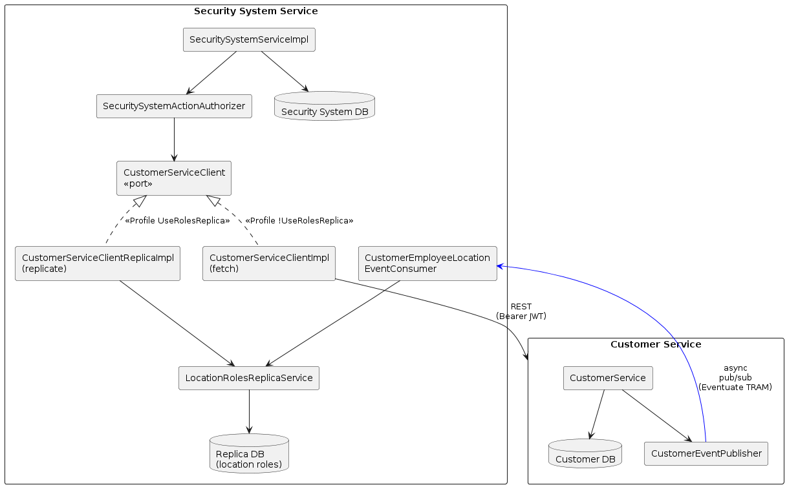
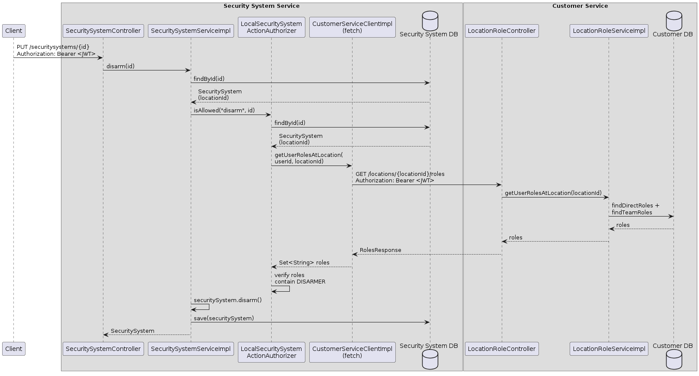
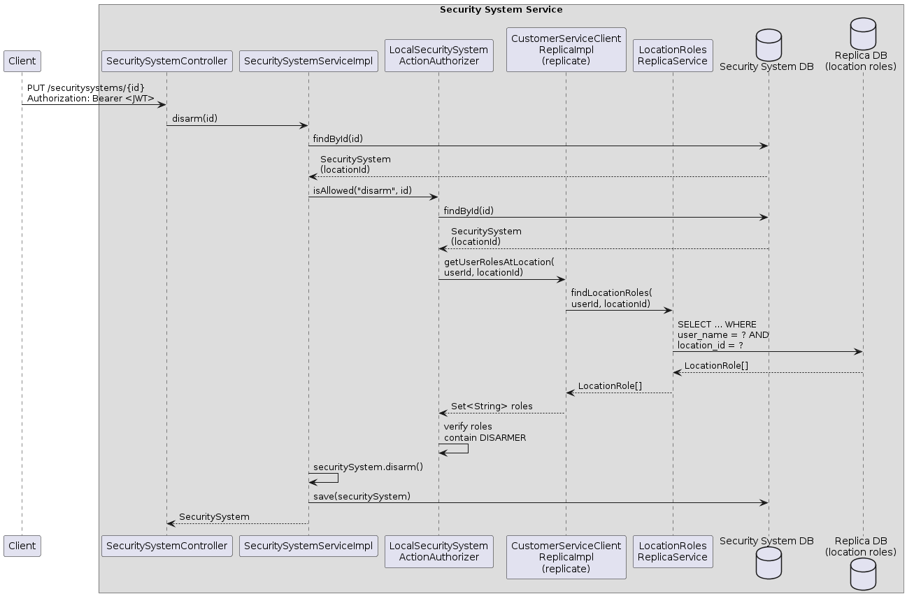
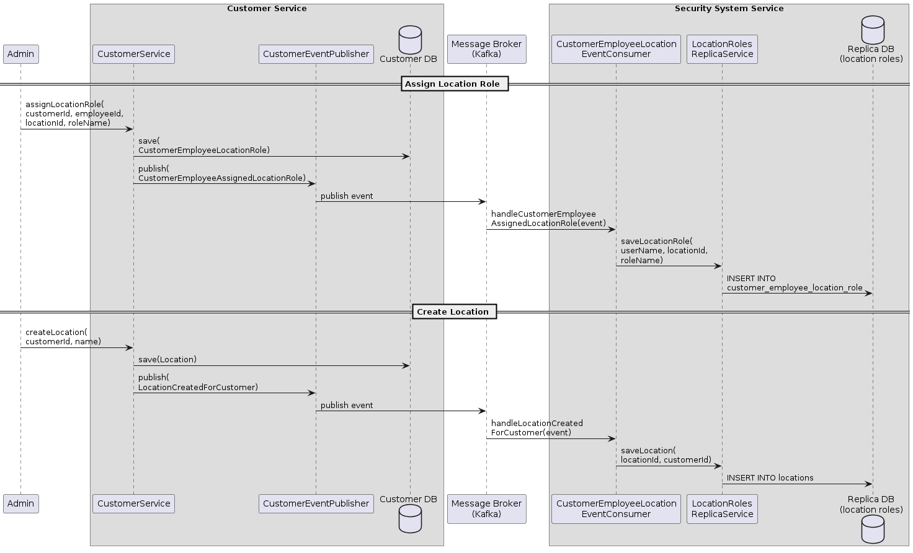

# Code Guide: Implementing Authorization Using Fetch and Replicate

This guide helps readers of the article [Implementing authorization using fetch and replicate](https://microservices.io/post/architecture/2025/09/16/microservices-authn-authz-part-4-authorization-using-fetch-and-replicate.html) navigate the RealGuardIO example codebase.

Note: this guide was generated by Claude Code using the following [prompt](article-prompts/part-4-prompt.md).

## Overview

The article describes two strategies for obtaining remote authorization data: **Fetch** (call another service at request time) and **Replicate** (maintain a local copy synchronized via events).
In the RealGuardIO application, the Security System Service needs to know a user's roles at a location to authorize actions like arming or disarming a security system.
This data is owned by the Customer Service.

The codebase implements both strategies behind a common `CustomerServiceClient` port interface, selectable via Spring profiles:
- **Fetch** (`!UseRolesReplica` profile): `CustomerServiceClientImpl` makes synchronous REST calls to the Customer Service
- **Replicate** (`UseRolesReplica` profile): `CustomerServiceClientReplicaImpl` queries a local replica maintained via asynchronous event-driven replication using Eventuate TRAM

This guide maps these patterns to the services, modules, classes, and collaboration chains that implement them.

## Key Components

The following diagram shows the key components of the fetch and replicate strategies.



<!-- Source: diagrams/part-4/key-components.txt (PlantUML) -->

The responsibilities of each component are as follows:

* **Customer Service** - The authoritative source of authorization data
  * Owns the customer-employee-location-role relationships
  * Exposes `GET /locations/{locationId}/roles` for the Fetch strategy
  * Publishes domain events (e.g., `CustomerEmployeeAssignedLocationRole`) for the Replicate strategy
* **Security System Service** - The consumer of remote authorization data
  * Uses `CustomerServiceClient` port to obtain a user's roles at a location
  * Fetch adapter (`CustomerServiceClientImpl`): calls Customer Service via REST, propagating the user's JWT
  * Replicate adapter (`CustomerServiceClientReplicaImpl`): queries a local CQRS read model
  * Event subscriber (`CustomerEmployeeLocationEventConsumer`): consumes Customer Service events and updates the local replica

## Customer Service

The Customer Service plays two roles: it serves as the data source for the Fetch strategy (via a REST endpoint) and as the event publisher for the Replicate strategy.

### Inbound adapter: location roles endpoint (Fetch strategy)

The `customer-service-restapi` module exposes the endpoint that the Security System Service calls when using the Fetch strategy.

**[LocationRoleController.java](../../realguardio-customer-service/customer-service-restapi/src/main/java/io/eventuate/examples/realguardio/customerservice/restapi/LocationRoleController.java)** - returns a user's roles at a specific location:

```java
@GetMapping("/locations/{locationId}/roles")
@PreAuthorize("hasRole('REALGUARDIO_CUSTOMER_EMPLOYEE') or hasRole('REALGUARDIO_ADMIN')")
public ResponseEntity<RolesResponse> getUserRolesAtLocation(
        @PathVariable("locationId") Long locationId) {
    Set<String> roles = locationRoleService.getUserRolesAtLocation(locationId);
    return ResponseEntity.ok(new RolesResponse(roles));
}
```

### Domain: location role service

**[LocationRoleServiceImpl.java](../../realguardio-customer-service/customer-service-domain/src/main/java/io/eventuate/examples/realguardio/customerservice/customermanagement/domain/LocationRoleServiceImpl.java)** - combines direct and team-based roles from the local database:

```java
@Override
public Set<String> getUserRolesAtLocation(Long locationId) {
    String userName = userNameSupplier.getCurrentUserEmail();
    Set<String> allRoles = new HashSet<>();
    allRoles.addAll(findDirectRolesForEmployeeAtLocation(userName, locationId));
    allRoles.addAll(findTeamRolesForEmployeeAtLocation(userName, locationId));
    return allRoles;
}
```

A user's roles at a location come from two sources: direct role assignments and team-based role assignments.
Both are queried from the Customer Service's own database.

### Domain: event publishing (Replicate strategy)

The Customer Service publishes domain events whenever authorization-relevant data changes.

**[CustomerEventPublisher.java](../../realguardio-customer-service/customer-service-domain/src/main/java/io/eventuate/examples/realguardio/customerservice/customermanagement/domain/CustomerEventPublisher.java)** - the event publishing port:

```java
public interface CustomerEventPublisher
    extends DomainEventPublisherForAggregate<Customer, Long, CustomerEvent> {
}
```

**[CustomerEventPublisherImpl.java](../../realguardio-customer-service/customer-service-event-publishing/src/main/java/io/eventuate/examples/realguardio/customerservice/customermanagement/eventpublishing/CustomerEventPublisherImpl.java)** - publishes events via Eventuate TRAM:

```java
public class CustomerEventPublisherImpl
    extends AbstractDomainEventPublisherForAggregateImpl<Customer, Long, CustomerEvent>
    implements CustomerEventPublisher {

    public CustomerEventPublisherImpl(DomainEventPublisher domainEventPublisher) {
        super(Customer.class, Customer::getId, domainEventPublisher, CustomerEvent.class);
    }
}
```

### Domain events

The Customer Service publishes these events that are consumed by the Security System Service's replica:

**[CustomerEmployeeAssignedLocationRole.java](../../realguardio-customer-service/customer-service-domain/src/main/java/io/eventuate/examples/realguardio/customerservice/domain/CustomerEmployeeAssignedLocationRole.java)** - emitted when a user is assigned a role at a location:

```java
public record CustomerEmployeeAssignedLocationRole(
    String userName,
    Long locationId,
    String roleName
) implements CustomerEvent {
}
```

**[LocationCreatedForCustomer.java](../../realguardio-customer-service/customer-service-domain/src/main/java/io/eventuate/examples/realguardio/customerservice/customermanagement/domain/LocationCreatedForCustomer.java)** - emitted when a new location is created:

```java
public record LocationCreatedForCustomer(Long locationId) implements CustomerEvent {
}
```

Additional events include `TeamMemberAdded` and `TeamAssignedLocationRole` for team-based role assignments.

## Security System Service

The Security System Service consumes remote authorization data through the `CustomerServiceClient` port.
The port has two implementations — one for each strategy — selected via Spring profiles.

### Domain: business logic and CustomerServiceClient port

**[SecuritySystemServiceImpl.java](../../realguardio-security-system-service/security-system-service-domain/src/main/java/io/eventuate/examples/realguardio/securitysystemservice/domain/SecuritySystemServiceImpl.java)** - delegates authorization to the authorizer:

```java
@Override
public SecuritySystem disarm(Long id) {
    SecuritySystem securitySystem = securitySystemRepository.findById(id)
        .orElseThrow(...);
    ...
    if (userNameSupplier.isCustomerEmployee())
        securitySystemActionAuthorizer.isAllowed(RolesAndPermissions.DISARM, id);

    securitySystem.disarm();
    return securitySystemRepository.save(securitySystem);
}
```

**[LocalSecuritySystemActionAuthorizer.java](../../realguardio-security-system-service/security-system-service-domain/src/main/java/io/eventuate/examples/realguardio/securitysystemservice/domain/LocalSecuritySystemActionAuthorizer.java)** - uses `CustomerServiceClient` to get remote authorization data:

```java
@Override
protected void isAllowedForCustomerEmployee(String permission, long securitySystemId) {
    Set<String> requiredRoles = RolesAndPermissions.rolesForPermission(permission);
    SecuritySystem securitySystem = securitySystemRepository.findById(securitySystemId)
        .orElseThrow(...);
    Long locationId = securitySystem.getLocationId();
    String userId = userNameSupplier.getCurrentUserName();

    Set<String> rolesAtLocation = customerServiceClient.getUserRolesAtLocation(userId, locationId);

    if (Collections.disjoint(rolesAtLocation, requiredRoles)) {
        throw new ForbiddenException(...);
    }
}
```

**[CustomerServiceClient.java](../../realguardio-security-system-service/security-system-service-domain/src/main/java/io/eventuate/examples/realguardio/securitysystemservice/domain/CustomerServiceClient.java)** - the port interface:

```java
public interface CustomerServiceClient {
    Set<String> getUserRolesAtLocation(String userId, Long locationId);
}
```

This port has two implementations, selected by `@Profile`:

### Outbound adapter: Fetch strategy (CustomerServiceClientImpl)

The `security-system-service-customer-service-proxy` module implements the Fetch strategy.

**[CustomerServiceClientImpl.java](../../realguardio-security-system-service/security-system-service-customer-service-proxy/src/main/java/io/eventuate/examples/realguardio/securitysystemservice/customerserviceproxy/CustomerServiceClientImpl.java)** - makes synchronous REST calls to the Customer Service:

```java
@Component
@Profile("!UseRolesReplica")
public class CustomerServiceClientImpl implements CustomerServiceClient {
    ...
    @Override
    public Set<String> getUserRolesAtLocation(String userId, Long locationId) {
        String url = customerServiceUrl + "/locations/" + locationId + "/roles";
        HttpHeaders headers = new HttpHeaders();
        headers.set(HttpHeaders.AUTHORIZATION, jwtProvider.getCurrentJwtToken());

        ResponseEntity<RolesResponse> response = restTemplate.exchange(
            url, HttpMethod.GET, new HttpEntity<>(headers), RolesResponse.class);

        return response.getBody().getRoles();
    }
}
```

Key characteristics of this implementation:
- Active when the `UseRolesReplica` profile is **not** enabled
- Propagates the user's JWT via `JwtProvider` to maintain authentication context
- Introduces **runtime coupling**: the Customer Service must be available at request time
- Returns **fresh data**: roles are always current at the time of the request

### Outbound adapter: Replicate strategy (CustomerServiceClientReplicaImpl)

The `security-system-location-roles-replica-domain` module implements the Replicate strategy.

**[CustomerServiceClientReplicaImpl.java](../../realguardio-security-system-service/security-system-location-roles-replica-domain/src/main/java/io/eventuate/examples/realguardio/securitysystemservice/locationroles/domain/CustomerServiceClientReplicaImpl.java)** - queries the local CQRS read model:

```java
public class CustomerServiceClientReplicaImpl implements CustomerServiceClient {
    ...
    @Override
    public Set<String> getUserRolesAtLocation(String userId, Long locationId) {
        List<LocationRole> locationRoles = locationRolesReplicaService.findLocationRoles(userId, locationId);
        Set<String> roles = locationRoles.stream()
            .map(LocationRole::roleName)
            .collect(Collectors.toSet());
        return roles;
    }
}
```

Key characteristics of this implementation:
- Active when the `UseRolesReplica` profile is enabled (configured in `LocationRolesReplicaDomainConfiguration`)
- Queries a local replica database — no cross-service call at request time
- **No runtime coupling**: the Customer Service can be unavailable and authorization still works
- **Potential data staleness**: the replica may lag behind the authoritative source

### Replicate: CQRS read model domain

The `security-system-location-roles-replica-domain` module defines the domain classes for the local replica.

**[LocationRole.java](../../realguardio-security-system-service/security-system-location-roles-replica-domain/src/main/java/io/eventuate/examples/realguardio/securitysystemservice/locationroles/domain/LocationRole.java)** - a record representing a replicated location role:

```java
public record LocationRole(
    Long id,
    String userName,
    Long locationId,
    String roleName
) {
}
```

**[LocationRolesRepository.java](../../realguardio-security-system-service/security-system-location-roles-replica-domain/src/main/java/io/eventuate/examples/realguardio/securitysystemservice/locationroles/domain/LocationRolesRepository.java)** - the persistence port:

```java
public interface LocationRolesRepository {
    void saveLocationRole(String userName, Long locationId, String roleName);
    void saveTeamMember(String teamId, String customerEmployeeId);
    void saveTeamLocationRole(String teamId, String roleName, Long locationId);
    void saveLocation(Long locationId, String customerId);
    List<LocationRole> findLocationRoles(String userName, Long locationId);
}
```

**[LocationRolesReplicaService.java](../../realguardio-security-system-service/security-system-location-roles-replica-domain/src/main/java/io/eventuate/examples/realguardio/securitysystemservice/locationroles/domain/LocationRolesReplicaService.java)** - coordinates the read model operations:

```java
public class LocationRolesReplicaService {
    private final LocationRolesRepository locationRolesRepository;
    ...
    public void saveLocationRole(String userName, Long locationId, String roleName) {
        locationRolesRepository.saveLocationRole(userName, locationId, roleName);
    }

    public List<LocationRole> findLocationRoles(String userName, Long locationId) {
        return locationRolesRepository.findLocationRoles(userName, locationId);
    }
}
```

### Replicate: event subscriber

The `security-system-location-roles-replica-event-subscribers` module subscribes to Customer Service events and updates the local replica.

**[CustomerEmployeeLocationEventConsumer.java](../../realguardio-security-system-service/security-system-location-roles-replica-event-subscribers/src/main/java/io/eventuate/examples/realguardio/securitysystemservice/locationroles/messaging/CustomerEmployeeLocationEventConsumer.java)** - handles domain events:

```java
@EventuateDomainEventHandler(
    subscriberId = "locationRolesReplicaDispatcher",
    channel = "io.eventuate.examples.realguardio.customerservice.customermanagement.domain.Customer")
public void handleCustomerEmployeeAssignedLocationRole(
        DomainEventEnvelope<CustomerEmployeeAssignedLocationRole> envelope) {
    CustomerEmployeeAssignedLocationRole event = envelope.getEvent();
    replicaService.saveLocationRole(
        event.userName(), event.locationId(), event.roleName());
}

@EventuateDomainEventHandler(...)
public void handleTeamMemberAdded(DomainEventEnvelope<TeamMemberAdded> envelope) {
    TeamMemberAdded event = envelope.getEvent();
    replicaService.saveTeamMember(
        event.teamId().toString(), event.customerEmployeeId().toString());
}

@EventuateDomainEventHandler(...)
public void handleTeamAssignedLocationRole(DomainEventEnvelope<TeamAssignedLocationRole> envelope) {
    TeamAssignedLocationRole event = envelope.getEvent();
    replicaService.saveTeamLocationRole(
        event.teamId().toString(), event.roleName(), event.locationId());
}

@EventuateDomainEventHandler(...)
public void handleLocationCreatedForCustomer(DomainEventEnvelope<LocationCreatedForCustomer> envelope) {
    LocationCreatedForCustomer event = envelope.getEvent();
    replicaService.saveLocation(event.locationId(), envelope.getAggregateId());
}
```

The event consumer subscribes to the `Customer` aggregate channel and handles four event types, each updating a different aspect of the replicated data.
This uses Eventuate TRAM's `@EventuateDomainEventHandler` for reliable, exactly-once event processing.

### Replicate: JDBC persistence

The `security-system-location-roles-replica-persistence` module implements the replica's persistence.

**[JdbcLocationRolesRepository.java](../../realguardio-security-system-service/security-system-location-roles-replica-persistence/src/main/java/io/eventuate/examples/realguardio/securitysystemservice/locationroles/persistence/JdbcLocationRolesRepository.java)** - uses JDBC to maintain the replica tables:

```java
@Override
public void saveLocationRole(String userName, Long locationId, String roleName) {
    String sql = "INSERT INTO customer_employee_location_role (user_name, location_id, role_name) VALUES (?, ?, ?)";
    jdbcTemplate.update(sql, userName, locationId, roleName);
}

@Override
public List<LocationRole> findLocationRoles(String userName, Long locationId) {
    String sql = "SELECT id, user_name, location_id, role_name FROM customer_employee_location_role WHERE user_name = ? AND location_id = ?";
    return jdbcTemplate.query(sql, locationRoleRowMapper, userName, locationId);
}
```

The repository also uses `ON CONFLICT ... DO NOTHING` for idempotent team member and team role inserts.

### Replicate: query via the Security System repository

The Replicate strategy also enables efficient list queries.
When a customer employee calls `findAll()`, the Security System Service needs to return only the security systems the user is authorized to view.

**[SecuritySystemRepository.java](../../realguardio-security-system-service/security-system-service-domain/src/main/java/io/eventuate/examples/realguardio/securitysystemservice/domain/SecuritySystemRepository.java)** - uses a native SQL query that joins the local security system table with the replicated location roles:

```java
@Query(value = """
    SELECT
      ss.id AS id, ss.location_name AS locationName,
      ss.state AS state, ss.location_id AS locationId,
      ss.rejection_reason AS rejectionReason, ss.version AS version,
      ARRAY_AGG(DISTINCT celr.role_name ORDER BY celr.role_name) AS roleNames
    FROM security_system ss
    JOIN customer_employee_location_role celr
      ON celr.location_id = ss.location_id
    WHERE celr.user_name = :userName
    GROUP BY ss.id
    """, nativeQuery = true)
List<SecuritySystemProjection> findAllAccessible(@Param("userName") String userName);
```

This query is only possible because the location role data has been replicated into the Security System Service's database, enabling an efficient local JOIN.
With the Fetch strategy, this query would require making N+1 calls to the Customer Service.

**[SecuritySystemFinderUsingRepository.java](../../realguardio-security-system-service/security-system-service-persistence/src/main/java/io/eventuate/examples/realguardio/securitysystemservice/persistence/finder/repository/SecuritySystemFinderUsingRepository.java)** - wraps the repository query:

```java
public class SecuritySystemFinderUsingRepository implements SecuritySystemFinder {
    @Override
    public List<SecuritySystemProjection> findAllAccessible(String userName) {
        return securitySystemRepository.findAllAccessible(userName);
    }
}
```

### Configuration: profile-based strategy selection

**[LocationRolesReplicaDomainConfiguration.java](../../realguardio-security-system-service/security-system-location-roles-replica-domain/src/main/java/io/eventuate/examples/realguardio/securitysystemservice/locationroles/domain/LocationRolesReplicaDomainConfiguration.java)** - configures the replica adapter:

```java
@Configuration
public class LocationRolesReplicaDomainConfiguration {

    @Bean
    LocationRolesReplicaService locationRolesReplicaService(LocationRolesRepository locationRolesRepository) {
        return new LocationRolesReplicaService(locationRolesRepository);
    }

    @Bean
    @Profile("UseRolesReplica")
    CustomerServiceClientReplicaImpl customerServiceClientReplicaImpl(
            LocationRolesReplicaService locationRolesReplicaService) {
        return new CustomerServiceClientReplicaImpl(locationRolesReplicaService);
    }
}
```

The `@Profile("UseRolesReplica")` annotation on `CustomerServiceClientReplicaImpl` and the `@Profile("!UseRolesReplica")` annotation on `CustomerServiceClientImpl` ensure that exactly one implementation of `CustomerServiceClient` is active at runtime.

## Service Collaboration

### Disarming a Security System Using the Fetch Strategy

When the `UseRolesReplica` profile is not active, the Security System Service fetches authorization data from the Customer Service via a synchronous REST call at request time.



<!-- Source: diagrams/part-4/disarm-using-fetch.txt (PlantUML) -->

1. **Request arrives** - The client sends `PUT /securitysystems/{id}` with an action of `DISARM` and a Bearer JWT.
2. **Local data lookup** - [SecuritySystemServiceImpl.java](../../realguardio-security-system-service/security-system-service-domain/src/main/java/io/eventuate/examples/realguardio/securitysystemservice/domain/SecuritySystemServiceImpl.java) retrieves the security system from the local database to get its `locationId`.
3. **Authorization check** - [LocalSecuritySystemActionAuthorizer.java](../../realguardio-security-system-service/security-system-service-domain/src/main/java/io/eventuate/examples/realguardio/securitysystemservice/domain/LocalSecuritySystemActionAuthorizer.java) determines the required roles and calls `customerServiceClient.getUserRolesAtLocation()`.
4. **Fetch remote data** - [CustomerServiceClientImpl.java](../../realguardio-security-system-service/security-system-service-customer-service-proxy/src/main/java/io/eventuate/examples/realguardio/securitysystemservice/customerserviceproxy/CustomerServiceClientImpl.java) sends `GET /locations/{locationId}/roles` to the Customer Service, forwarding the user's JWT.
5. **Customer Service responds** - [LocationRoleController.java](../../realguardio-customer-service/customer-service-restapi/src/main/java/io/eventuate/examples/realguardio/customerservice/restapi/LocationRoleController.java) returns the user's roles, combining direct and team-based assignments via [LocationRoleServiceImpl.java](../../realguardio-customer-service/customer-service-domain/src/main/java/io/eventuate/examples/realguardio/customerservice/customermanagement/domain/LocationRoleServiceImpl.java).
6. **Permission verified** - The authorizer checks that the returned roles include `SECURITY_SYSTEM_DISARMER`.
7. **Action performed** - The security system is disarmed and saved.

### Disarming a Security System Using the Replicate Strategy

When the `UseRolesReplica` profile is active, the Security System Service queries its local CQRS read model instead of calling the Customer Service.



<!-- Source: diagrams/part-4/disarm-using-replicate.txt (PlantUML) -->

1. **Request arrives** - The client sends `PUT /securitysystems/{id}` with an action of `DISARM` and a Bearer JWT.
2. **Local data lookup** - [SecuritySystemServiceImpl.java](../../realguardio-security-system-service/security-system-service-domain/src/main/java/io/eventuate/examples/realguardio/securitysystemservice/domain/SecuritySystemServiceImpl.java) retrieves the security system from the local database to get its `locationId`.
3. **Authorization check** - [LocalSecuritySystemActionAuthorizer.java](../../realguardio-security-system-service/security-system-service-domain/src/main/java/io/eventuate/examples/realguardio/securitysystemservice/domain/LocalSecuritySystemActionAuthorizer.java) calls `customerServiceClient.getUserRolesAtLocation()`.
4. **Local replica query** - [CustomerServiceClientReplicaImpl.java](../../realguardio-security-system-service/security-system-location-roles-replica-domain/src/main/java/io/eventuate/examples/realguardio/securitysystemservice/locationroles/domain/CustomerServiceClientReplicaImpl.java) queries the local replica via [LocationRolesReplicaService.java](../../realguardio-security-system-service/security-system-location-roles-replica-domain/src/main/java/io/eventuate/examples/realguardio/securitysystemservice/locationroles/domain/LocationRolesReplicaService.java), which queries the `customer_employee_location_role` table in the Security System Service's own database.
5. **Permission verified** - The authorizer checks that the returned roles include `SECURITY_SYSTEM_DISARMER`.
6. **Action performed** - The security system is disarmed and saved.

### Event-Driven Replication

The Customer Service publishes domain events via Eventuate TRAM whenever authorization-relevant data changes.
The Security System Service's event consumer subscribes to these events and updates the local replica.



<!-- Source: diagrams/part-4/event-replication.txt (PlantUML) -->

1. **Admin assigns a location role** - [CustomerService.java](../../realguardio-customer-service/customer-service-domain/src/main/java/io/eventuate/examples/realguardio/customerservice/customermanagement/domain/CustomerService.java) assigns a role (e.g., `SECURITY_SYSTEM_DISARMER`) to a customer employee at a location and publishes a `CustomerEmployeeAssignedLocationRole` event via [CustomerEventPublisherImpl.java](../../realguardio-customer-service/customer-service-event-publishing/src/main/java/io/eventuate/examples/realguardio/customerservice/customermanagement/eventpublishing/CustomerEventPublisherImpl.java).
2. **Event delivered** - Eventuate TRAM delivers the event via Kafka to the Security System Service.
3. **Replica updated** - [CustomerEmployeeLocationEventConsumer.java](../../realguardio-security-system-service/security-system-location-roles-replica-event-subscribers/src/main/java/io/eventuate/examples/realguardio/securitysystemservice/locationroles/messaging/CustomerEmployeeLocationEventConsumer.java) handles the event and calls `replicaService.saveLocationRole()` to insert the role into the local `customer_employee_location_role` table via [JdbcLocationRolesRepository.java](../../realguardio-security-system-service/security-system-location-roles-replica-persistence/src/main/java/io/eventuate/examples/realguardio/securitysystemservice/locationroles/persistence/JdbcLocationRolesRepository.java).

The same pattern applies to `LocationCreatedForCustomer`, `TeamMemberAdded`, and `TeamAssignedLocationRole` events.

## Project Structure

| Service | Module | Architectural Role | Key Files |
|---------|--------|--------------------|-----------|
| Customer | [customer-service-restapi](../../realguardio-customer-service/customer-service-restapi/src/main/java/io/eventuate/examples/realguardio/customerservice/restapi) | Inbound adapter (location roles endpoint for Fetch) | [LocationRoleController.java](../../realguardio-customer-service/customer-service-restapi/src/main/java/io/eventuate/examples/realguardio/customerservice/restapi/LocationRoleController.java) |
| Customer | [customer-service-domain](../../realguardio-customer-service/customer-service-domain/src/main/java/io/eventuate/examples/realguardio/customerservice/customermanagement/domain) | Domain (authorization data, event publishing port) | [LocationRoleServiceImpl.java](../../realguardio-customer-service/customer-service-domain/src/main/java/io/eventuate/examples/realguardio/customerservice/customermanagement/domain/LocationRoleServiceImpl.java), [CustomerEventPublisher.java](../../realguardio-customer-service/customer-service-domain/src/main/java/io/eventuate/examples/realguardio/customerservice/customermanagement/domain/CustomerEventPublisher.java) |
| Customer | [customer-service-domain](../../realguardio-customer-service/customer-service-domain/src/main/java/io/eventuate/examples/realguardio/customerservice/domain) | Domain events | [CustomerEmployeeAssignedLocationRole.java](../../realguardio-customer-service/customer-service-domain/src/main/java/io/eventuate/examples/realguardio/customerservice/domain/CustomerEmployeeAssignedLocationRole.java), [LocationCreatedForCustomer.java](../../realguardio-customer-service/customer-service-domain/src/main/java/io/eventuate/examples/realguardio/customerservice/customermanagement/domain/LocationCreatedForCustomer.java) |
| Customer | [customer-service-event-publishing](../../realguardio-customer-service/customer-service-event-publishing/src/main/java/io/eventuate/examples/realguardio/customerservice/customermanagement/eventpublishing) | Outbound adapter (event publishing via Eventuate TRAM) | [CustomerEventPublisherImpl.java](../../realguardio-customer-service/customer-service-event-publishing/src/main/java/io/eventuate/examples/realguardio/customerservice/customermanagement/eventpublishing/CustomerEventPublisherImpl.java) |
| Security System | [security-system-service-domain](../../realguardio-security-system-service/security-system-service-domain/src/main/java/io/eventuate/examples/realguardio/securitysystemservice/domain) | Domain (authorization logic, CustomerServiceClient port) | [SecuritySystemServiceImpl.java](../../realguardio-security-system-service/security-system-service-domain/src/main/java/io/eventuate/examples/realguardio/securitysystemservice/domain/SecuritySystemServiceImpl.java), [LocalSecuritySystemActionAuthorizer.java](../../realguardio-security-system-service/security-system-service-domain/src/main/java/io/eventuate/examples/realguardio/securitysystemservice/domain/LocalSecuritySystemActionAuthorizer.java), [CustomerServiceClient.java](../../realguardio-security-system-service/security-system-service-domain/src/main/java/io/eventuate/examples/realguardio/securitysystemservice/domain/CustomerServiceClient.java) |
| Security System | [security-system-service-customer-service-proxy](../../realguardio-security-system-service/security-system-service-customer-service-proxy/src/main/java/io/eventuate/examples/realguardio/securitysystemservice/customerserviceproxy) | Outbound adapter (Fetch strategy via REST) | [CustomerServiceClientImpl.java](../../realguardio-security-system-service/security-system-service-customer-service-proxy/src/main/java/io/eventuate/examples/realguardio/securitysystemservice/customerserviceproxy/CustomerServiceClientImpl.java) |
| Security System | [security-system-location-roles-replica-domain](../../realguardio-security-system-service/security-system-location-roles-replica-domain/src/main/java/io/eventuate/examples/realguardio/securitysystemservice/locationroles/domain) | Domain (CQRS read model, Replicate strategy) | [CustomerServiceClientReplicaImpl.java](../../realguardio-security-system-service/security-system-location-roles-replica-domain/src/main/java/io/eventuate/examples/realguardio/securitysystemservice/locationroles/domain/CustomerServiceClientReplicaImpl.java), [LocationRolesReplicaService.java](../../realguardio-security-system-service/security-system-location-roles-replica-domain/src/main/java/io/eventuate/examples/realguardio/securitysystemservice/locationroles/domain/LocationRolesReplicaService.java), [LocationRole.java](../../realguardio-security-system-service/security-system-location-roles-replica-domain/src/main/java/io/eventuate/examples/realguardio/securitysystemservice/locationroles/domain/LocationRole.java), [LocationRolesRepository.java](../../realguardio-security-system-service/security-system-location-roles-replica-domain/src/main/java/io/eventuate/examples/realguardio/securitysystemservice/locationroles/domain/LocationRolesRepository.java) |
| Security System | [security-system-location-roles-replica-event-subscribers](../../realguardio-security-system-service/security-system-location-roles-replica-event-subscribers/src/main/java/io/eventuate/examples/realguardio/securitysystemservice/locationroles/messaging) | Inbound adapter (event consumer for replication) | [CustomerEmployeeLocationEventConsumer.java](../../realguardio-security-system-service/security-system-location-roles-replica-event-subscribers/src/main/java/io/eventuate/examples/realguardio/securitysystemservice/locationroles/messaging/CustomerEmployeeLocationEventConsumer.java) |
| Security System | [security-system-location-roles-replica-persistence](../../realguardio-security-system-service/security-system-location-roles-replica-persistence/src/main/java/io/eventuate/examples/realguardio/securitysystemservice/locationroles/persistence) | Outbound adapter (JDBC persistence for replica) | [JdbcLocationRolesRepository.java](../../realguardio-security-system-service/security-system-location-roles-replica-persistence/src/main/java/io/eventuate/examples/realguardio/securitysystemservice/locationroles/persistence/JdbcLocationRolesRepository.java) |
| Security System | [security-system-service-persistence](../../realguardio-security-system-service/security-system-service-persistence/src/main/java/io/eventuate/examples/realguardio/securitysystemservice/persistence/finder/repository) | Domain (SecuritySystemFinder using replica JOIN) | [SecuritySystemFinderUsingRepository.java](../../realguardio-security-system-service/security-system-service-persistence/src/main/java/io/eventuate/examples/realguardio/securitysystemservice/persistence/finder/repository/SecuritySystemFinderUsingRepository.java) |
