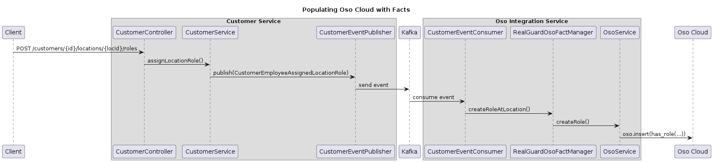
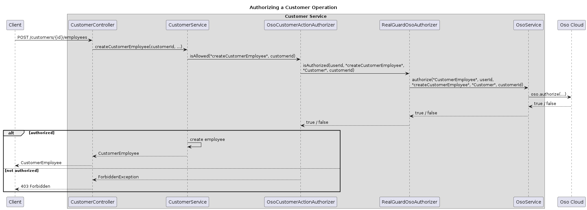
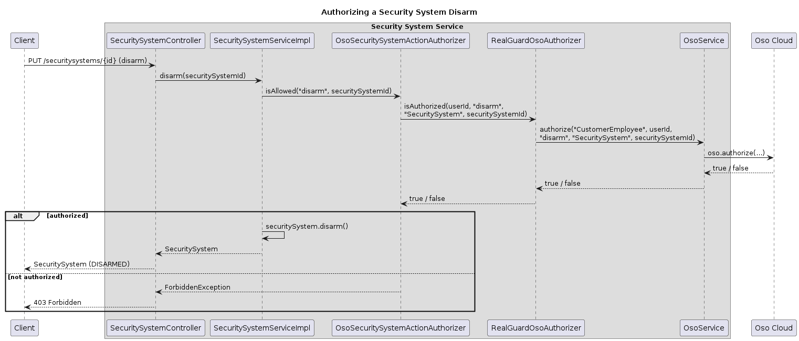

# Code Guide: Implementing Complex Authorization Using Oso Cloud

This guide helps readers of the article [Implementing complex authorization using Oso Cloud](https://microservices.io/post/architecture/2025/12/09/microservices-authn-authz-part-5-using-an-authorization-service.html) navigate the RealGuardIO example codebase.

Note: this guide was generated by Claude Code using the following [prompt](article-prompts/part-5-prompt.md).

## Overview

The RealGuardIO application demonstrates how to integrate an authorization-as-a-service platform (Oso Cloud) into a microservices architecture.
This guide maps the concepts from the article to the architectural elements that implement them: services, modules within those services, the classes within those modules, and the collaboration patterns between them.

## Key Components

The key components of the Oso Cloud integration are:

* **Oso Cloud** - An external cloud-based authorization service
  * Stores the Polar policy that defines actors, resources, roles, and permissions
  * Stores facts that describe the current state of the system
  * Evaluates authorization decisions via the `authorize()` REST API
* **Oso Integration Service** - A microservice that bridges domain events to Oso Cloud
  * Subscribes to events published by other services (asynchronous pub/sub collaboration)
  * Creates corresponding facts in Oso Cloud (synchronous REST collaboration)
* **Customer Service** - A microservice that owns customer and employee data
  * Publishes events when authorization-relevant data changes, which the Oso Integration Service uses to create facts
  * Delegates authorization decisions to Oso Cloud via an outbound adapter
* **Security System Service** - A microservice that manages security systems
  * Publishes events when a security system is assigned to a location, which the Oso Integration Service uses to create facts
  * Delegates authorization decisions to Oso Cloud via an outbound adapter

## Oso Cloud

Oso Cloud is an external cloud-based service that the application interacts with via REST APIs.
It plays two roles: storing facts that describe the current state of the system, and evaluating authorization decisions against a declarative policy.

### The Polar Policy

The authorization policy is written in Oso's Polar language:

[main.polar](../../realguardio-oso-integration-service/policies/main.polar)

This file defines:

* **Actor**: `CustomerEmployee` - users who perform actions
* **Resources**: `Customer`, `Location`, `SecuritySystem`, `Team`
* **Roles**: `COMPANY_ROLE_ADMIN`, `SECURITY_SYSTEM_ARMER`, `SECURITY_SYSTEM_DISARMER`, `SECURITY_SYSTEM_VIEWER`
* **Permissions**: `createCustomerEmployee`, `createLocation`, `arm`, `disarm`, `view`

Key policy excerpts discussed in the article:

**Simple permission rule (lines 7-8)**
```polar
"createCustomerEmployee" if "COMPANY_ROLE_ADMIN";
"createLocation" if "COMPANY_ROLE_ADMIN";
```

**Role inheritance through relationships (lines 23-32)** - a role at a `Customer` is inherited by its `Locations`:
```polar
resource Location {
  relations = { customer: Customer };
  roles = ["SECURITY_SYSTEM_ARMER", "SECURITY_SYSTEM_DISARMER", "SECURITY_SYSTEM_VIEWER"];

  "SECURITY_SYSTEM_ARMER" if "SECURITY_SYSTEM_ARMER" on "customer";
  "SECURITY_SYSTEM_DISARMER" if "SECURITY_SYSTEM_DISARMER" on "customer";
  "SECURITY_SYSTEM_VIEWER" if "SECURITY_SYSTEM_VIEWER" on "customer";
}
```

**Team membership rule (lines 17-20)** - a `CustomerEmployee` inherits roles from their `Team`:
```polar
has_role(u: CustomerEmployee, role: String, loc: Location) if
  team matches Team and
  has_relation(team, "members", u) and
  has_role(team, role, loc);
```

### Running the Policy Tests

The Polar policy includes built-in tests (lines 51-88 of [main.polar](../../realguardio-oso-integration-service/policies/main.polar)). Run them with:

```shell
oso-cloud test realguardio-oso-integration-service/policies/main.polar
```

## Oso Integration Service

The Oso Integration Service is a microservice that bridges domain events to Oso Cloud.
It collaborates with the Customer Service and Security System Service via asynchronous publish/subscribe (consuming their events), and with Oso Cloud via synchronous REST calls (creating facts).

### Inbound adapter: event subscribers

The `oso-event-subscribers` module contains inbound adapters that subscribe to domain events.

**[CustomerEventConsumer.java](../../realguardio-oso-integration-service/oso-event-subscribers/src/main/java/io/realguardio/osointegration/eventsubscribers/CustomerEventConsumer.java)** handles events from the Customer Service:

```java
@EventuateDomainEventHandler(subscriberId = "osoEventSubscribersDispatcher",
    channel = "...Customer")
public void handleCustomerEmployeeAssignedLocationRole(
        DomainEventEnvelope<CustomerEmployeeAssignedLocationRole> envelope) {
    CustomerEmployeeAssignedLocationRole event = envelope.getEvent();
    osoFactManager.createRoleAtLocation(
        event.userName(), event.locationId().toString(), event.roleName());
}
```

**[SecuritySystemEventConsumer.java](../../realguardio-oso-integration-service/oso-event-subscribers/src/main/java/io/realguardio/osointegration/eventsubscribers/SecuritySystemEventConsumer.java)** handles events from the Security System Service:

```java
@EventuateDomainEventHandler(subscriberId = "osoEventSubscribersDispatcher",
    channel = "...SecuritySystem")
public void handleSecuritySystemAssignedToLocation(
        DomainEventEnvelope<SecuritySystemAssignedToLocation> envelope) {
    SecuritySystemAssignedToLocation event = envelope.getEvent();
    osoFactManager.assignSecuritySystemToLocation(
        event.securitySystemId().toString(), event.locationId().toString());
}
```

### Domain: fact management

The `oso-service` module contains the domain logic for managing Oso facts.

**[RealGuardOsoFactManager.java](../../realguardio-oso-integration-service/oso-service/src/main/java/io/realguardio/osointegration/ososervice/RealGuardOsoFactManager.java)** translates domain concepts into Oso facts:

```java
public void createRoleAtLocation(String user, String location, String role) {
    osoService.createRole("CustomerEmployee", user, role, "Location", location);
}

public void assignSecuritySystemToLocation(String securitySystem, String location) {
    osoService.createRelation("SecuritySystem", securitySystem, "location", "Location", location);
}
```

### Outbound adapter: Oso Cloud REST API

**[OsoService.java](../../realguardio-oso-integration-service/oso-service/src/main/java/io/realguardio/osointegration/ososervice/OsoService.java)** is the outbound adapter that calls the Oso Cloud REST API using the Oso Java SDK:

```java
public void createRole(String actorType, String actorId, String role,
                       String resourceType, String resourceId) {
    oso.insert(new Fact("has_role",
            new Value(actorType, actorId), new Value(role),
            new Value(resourceType, resourceId)));
}

public boolean authorize(String actorType, String actorId, String action,
                         String resourceType, String resourceId) {
    return oso.authorize(
            new Value(actorType, actorId), action,
            new Value(resourceType, resourceId));
}
```

## Customer Service

The Customer Service owns customer, employee, role, and location data.
It is involved in the Oso integration in two ways: it publishes events when authorization-relevant data changes, and it delegates authorization decisions to Oso Cloud.

### Domain: business logic and authorization port

The `customer-service-domain` module contains the core business logic.

**[CustomerService.java](../../realguardio-customer-service/customer-service-domain/src/main/java/io/eventuate/examples/realguardio/customerservice/customermanagement/domain/CustomerService.java)** publishes events when authorization data changes and delegates authorization decisions via a port:

```java
customerActionAuthorizer.isAllowed(RolesAndPermissions.Permissions.CREATE_CUSTOMER_EMPLOYEE, customerId);
```

```java
customerEventPublisher.publish(customer,
    new CustomerEmployeeAssignedLocationRole(userName, locationId, roleName));
```

**[CustomerActionAuthorizer.java](../../realguardio-customer-service/customer-service-domain/src/main/java/io/eventuate/examples/realguardio/customerservice/customermanagement/domain/CustomerActionAuthorizer.java)** is the port (interface) that defines the authorization contract:

```java
public interface CustomerActionAuthorizer {
  void isAllowed(String permission, long customerId);
}
```

This port has two implementations, selected by Spring profile:

#### Local adapter (default)

**[LocalCustomerActionAuthorizer.java](../../realguardio-customer-service/customer-service-domain/src/main/java/io/eventuate/examples/realguardio/customerservice/customermanagement/domain/LocalCustomerActionAuthorizer.java)** queries the local database using a JPA repository method call:

```java
@Override
public void isAllowed(String permission, long customerId) {
    Set<String> requiredRoles = RolesAndPermissions.rolesForPermission(permission);
    String userId = userNameSupplier.getCurrentUserEmail();
    Set<String> currentUserRolesAtCustomer =
        customerEmployeeRepository.findRolesInCustomer(customerId, userId);
    if (Collections.disjoint(currentUserRolesAtCustomer, requiredRoles)) {
        throw new NotAuthorizedException(...);
    }
}
```

**[CustomerEmployeeRepository.java](../../realguardio-customer-service/customer-service-domain/src/main/java/io/eventuate/examples/realguardio/customerservice/customermanagement/domain/CustomerEmployeeRepository.java)** - the JPA query that joins tables to find user roles:

```java
@Query("""
    SELECT mr.name
    FROM MemberRole mr, CustomerEmployee ce
    WHERE mr.member.id = ce.memberId
    AND mr.member.emailAddress.email = :employeeUserId
    AND ce.customerId = :customerId
    """)
Set<String> findRolesInCustomer(@Param("customerId") Long customerId,
                                @Param("employeeUserId") String employeeUserId);
```

#### Oso outbound adapter

**[OsoCustomerActionAuthorizer.java](../../realguardio-customer-service/customer-service-oso-integration/src/main/java/io/eventuate/examples/realguardio/customerservice/osointegration/OsoCustomerActionAuthorizer.java)** in the `customer-service-oso-integration` module delegates to Oso Cloud via a synchronous REST call:

```java
@Override
public void isAllowed(String permission, long customerId) {
    String userId = userNameSupplier.getCurrentUserEmail();
    if (!realGuardOsoAuthorizer.isAuthorized(userId, permission, "Customer",
            String.valueOf(customerId)).get()) {
        throw new ForbiddenException(...);
    }
}
```

## Security System Service

The Security System Service manages security systems.
It delegates authorization decisions to Oso Cloud and publishes events when security systems are assigned to locations.

### Domain: business logic and authorization port

The `security-system-service-domain` module contains the core business logic.

**[SecuritySystemServiceImpl.java](../../realguardio-security-system-service/security-system-service-domain/src/main/java/io/eventuate/examples/realguardio/securitysystemservice/domain/SecuritySystemServiceImpl.java)** delegates authorization via a port:

```java
@Override
public SecuritySystem disarm(Long id) {
    SecuritySystem securitySystem = securitySystemRepository.findById(id)
        .orElseThrow(() -> new NotFoundException("Security system not found: " + id));

    securitySystemActionAuthorizer.isAllowed(RolesAndPermissions.DISARM, id);

    securitySystem.disarm();
    return securitySystemRepository.save(securitySystem);
}
```

**[SecuritySystemActionAuthorizer.java](../../realguardio-security-system-service/security-system-service-domain/src/main/java/io/eventuate/examples/realguardio/securitysystemservice/domain/SecuritySystemActionAuthorizer.java)** is the port:

```java
public interface SecuritySystemActionAuthorizer {
  void isAllowed(String permission, long securitySystemId);
}
```

**[AbstractSecuritySystemActionAuthorizer.java](../../realguardio-security-system-service/security-system-service-domain/src/main/java/io/eventuate/examples/realguardio/securitysystemservice/domain/AbstractSecuritySystemActionAuthorizer.java)** handles the common logic of only checking authorization for customer employees:

```java
public void isAllowed(String permission, long securitySystemId) {
    if (userNameSupplier.isCustomerEmployee())
        isAllowedForCustomerEmployee(permission, securitySystemId);
}

protected abstract void isAllowedForCustomerEmployee(String permission, long securitySystemId);
```

This port has two implementations, selected by Spring profile:

#### Local adapter (default)

**[LocalSecuritySystemActionAuthorizer.java](../../realguardio-security-system-service/security-system-service-domain/src/main/java/io/eventuate/examples/realguardio/securitysystemservice/domain/LocalSecuritySystemActionAuthorizer.java)** fetches roles from the Customer Service via a synchronous REST call:

```java
@Override
protected void isAllowedForCustomerEmployee(String permission, long securitySystemId) {
    Set<String> requiredRoles = RolesAndPermissions.rolesForPermission(permission);
    SecuritySystem securitySystem = securitySystemRepository.findById(securitySystemId)...;
    String userId = userNameSupplier.getCurrentUserName();
    Set<String> rolesAtLocation =
        customerServiceClient.getUserRolesAtLocation(userId, securitySystem.getLocationId());
    if (Collections.disjoint(rolesAtLocation, requiredRoles)) {
        throw new ForbiddenException(...);
    }
}
```

#### Oso outbound adapter

**[OsoSecuritySystemActionAuthorizer.java](../../realguardio-security-system-service/security-system-service-oso-integration/src/main/java/io/eventuate/examples/realguardio/securitysystemservice/osointegration/OsoSecuritySystemActionAuthorizer.java)** in the `security-system-service-oso-integration` module delegates to Oso Cloud via a synchronous REST call:

```java
@Override
protected void isAllowedForCustomerEmployee(String permission, long securitySystemId) {
    String userId = userNameSupplier.getCurrentUserName();
    if (!realGuardOsoAuthorizer.isAuthorized(userId, permission, "SecuritySystem",
            String.valueOf(securitySystemId)).get()) {
        throw new ForbiddenException(...);
    }
}
```

## Switching Between Local and Oso Authorization

The application uses Spring profiles to select which adapter implements each authorization port:

* `@Profile("!UseOsoService")` - Local authorization adapter (default)
* `@Profile("UseOsoService")` - Oso Cloud authorization adapter

## Service Collaboration

### Populating Oso Cloud with facts

When authorization-relevant data changes, the Customer Service publishes an event that the Oso Integration Service consumes to create a fact in Oso Cloud.



<!-- Source: diagrams/part-5/populating-oso-with-facts.txt (PlantUML) -->

1. **Customer Service assigns a location role** - `CustomerService.assignLocationRole()` assigns the role and publishes a `CustomerEmployeeAssignedLocationRole` event via [CustomerEventPublisher](../../realguardio-customer-service/customer-service-event-publishing). The Transactional Outbox pattern ensures the role assignment and event publication are atomic.
2. **Event is delivered via Kafka** - The event is published to Kafka and delivered to the Oso Integration Service.
3. **Oso Integration Service consumes the event** - [CustomerEventConsumer.java](../../realguardio-oso-integration-service/oso-event-subscribers/src/main/java/io/realguardio/osointegration/eventsubscribers/CustomerEventConsumer.java) handles the event.
4. **Fact manager translates to an Oso fact** - [RealGuardOsoFactManager.java](../../realguardio-oso-integration-service/oso-service/src/main/java/io/realguardio/osointegration/ososervice/RealGuardOsoFactManager.java) calls `createRoleAtLocation()`.
5. **Fact is created in Oso Cloud** - [OsoService.java](../../realguardio-oso-integration-service/oso-service/src/main/java/io/realguardio/osointegration/ososervice/OsoService.java) calls `oso.insert(has_role(...))` via the Oso REST API.

### Authorizing a customer operation

When the Customer Service needs to authorize a request, it delegates the decision to Oso Cloud.



<!-- Source: diagrams/part-5/authorizing-customer-operation.txt (PlantUML) -->

1. **Client calls createCustomerEmployee** - The request arrives at [CustomerService.java](../../realguardio-customer-service/customer-service-domain/src/main/java/io/eventuate/examples/realguardio/customerservice/customermanagement/domain/CustomerService.java).
2. **Domain calls the authorization port** - `CustomerService` calls `customerActionAuthorizer.isAllowed("createCustomerEmployee", customerId)`.
3. **Oso adapter checks with Oso Cloud** - [OsoCustomerActionAuthorizer.java](../../realguardio-customer-service/customer-service-oso-integration/src/main/java/io/eventuate/examples/realguardio/customerservice/osointegration/OsoCustomerActionAuthorizer.java) calls `oso.authorize(CustomerEmployee{userId}, "createCustomerEmployee", Customer{customerId})` via the Oso REST API.
4. **Oso Cloud evaluates the policy** - Oso matches the request against the Polar policy and stored facts, returning `true` or `false`.
5. **Request proceeds or is rejected** - If authorized, the employee is created; otherwise, a `ForbiddenException` is thrown.

### Authorizing a security system disarm

When the Security System Service needs to authorize an arm/disarm request, it delegates the decision to Oso Cloud. This is the cross-service authorization scenario from the article - the authorization decision depends on roles and relationships owned by the Customer Service, but the Security System Service no longer needs to fetch that data itself.



<!-- Source: diagrams/part-5/authorizing-security-system-disarm.txt (PlantUML) -->

1. **Client calls disarm** - The request arrives at [SecuritySystemServiceImpl.java](../../realguardio-security-system-service/security-system-service-domain/src/main/java/io/eventuate/examples/realguardio/securitysystemservice/domain/SecuritySystemServiceImpl.java).
2. **Domain calls the authorization port** - `SecuritySystemServiceImpl` calls `securitySystemActionAuthorizer.isAllowed("disarm", securitySystemId)`.
3. **Abstract base class checks user type** - [AbstractSecuritySystemActionAuthorizer.java](../../realguardio-security-system-service/security-system-service-domain/src/main/java/io/eventuate/examples/realguardio/securitysystemservice/domain/AbstractSecuritySystemActionAuthorizer.java) only checks authorization for customer employees.
4. **Oso adapter checks with Oso Cloud** - [OsoSecuritySystemActionAuthorizer.java](../../realguardio-security-system-service/security-system-service-oso-integration/src/main/java/io/eventuate/examples/realguardio/securitysystemservice/osointegration/OsoSecuritySystemActionAuthorizer.java) calls `oso.authorize(CustomerEmployee{userId}, "disarm", SecuritySystem{securitySystemId})` via the Oso REST API.
5. **Oso Cloud evaluates the policy** - Oso resolves the permission through the chain of relationships (SecuritySystem -> Location -> Customer) and role inheritance rules, using facts previously populated by the Oso Integration Service.
6. **Request proceeds or is rejected** - If authorized, the security system is disarmed; otherwise, a `ForbiddenException` is thrown.

## Project Structure

| Service | Module | Architectural Role | Key Files |
|---------|--------|--------------------|-----------|
| Oso Cloud | [policies](../../realguardio-oso-integration-service/policies) | External service | [main.polar](../../realguardio-oso-integration-service/policies/main.polar) |
| Oso Integration | [oso-event-subscribers](../../realguardio-oso-integration-service/oso-event-subscribers/src/main/java/io/realguardio/osointegration/eventsubscribers) | Inbound adapter | [CustomerEventConsumer.java](../../realguardio-oso-integration-service/oso-event-subscribers/src/main/java/io/realguardio/osointegration/eventsubscribers/CustomerEventConsumer.java), [SecuritySystemEventConsumer.java](../../realguardio-oso-integration-service/oso-event-subscribers/src/main/java/io/realguardio/osointegration/eventsubscribers/SecuritySystemEventConsumer.java) |
| Oso Integration | [oso-service](../../realguardio-oso-integration-service/oso-service/src/main/java/io/realguardio/osointegration/ososervice) | Domain + Outbound adapter | [RealGuardOsoFactManager.java](../../realguardio-oso-integration-service/oso-service/src/main/java/io/realguardio/osointegration/ososervice/RealGuardOsoFactManager.java), [OsoService.java](../../realguardio-oso-integration-service/oso-service/src/main/java/io/realguardio/osointegration/ososervice/OsoService.java) |
| Customer | [customer-service-domain](../../realguardio-customer-service/customer-service-domain/src/main/java/io/eventuate/examples/realguardio/customerservice/customermanagement/domain) | Domain (port + local adapter) | [CustomerService.java](../../realguardio-customer-service/customer-service-domain/src/main/java/io/eventuate/examples/realguardio/customerservice/customermanagement/domain/CustomerService.java), [CustomerActionAuthorizer.java](../../realguardio-customer-service/customer-service-domain/src/main/java/io/eventuate/examples/realguardio/customerservice/customermanagement/domain/CustomerActionAuthorizer.java), [LocalCustomerActionAuthorizer.java](../../realguardio-customer-service/customer-service-domain/src/main/java/io/eventuate/examples/realguardio/customerservice/customermanagement/domain/LocalCustomerActionAuthorizer.java) |
| Customer | [customer-service-oso-integration](../../realguardio-customer-service/customer-service-oso-integration/src/main/java/io/eventuate/examples/realguardio/customerservice/osointegration) | Outbound adapter | [OsoCustomerActionAuthorizer.java](../../realguardio-customer-service/customer-service-oso-integration/src/main/java/io/eventuate/examples/realguardio/customerservice/osointegration/OsoCustomerActionAuthorizer.java) |
| Security System | [security-system-service-domain](../../realguardio-security-system-service/security-system-service-domain/src/main/java/io/eventuate/examples/realguardio/securitysystemservice/domain) | Domain (port + local adapter) | [SecuritySystemServiceImpl.java](../../realguardio-security-system-service/security-system-service-domain/src/main/java/io/eventuate/examples/realguardio/securitysystemservice/domain/SecuritySystemServiceImpl.java), [SecuritySystemActionAuthorizer.java](../../realguardio-security-system-service/security-system-service-domain/src/main/java/io/eventuate/examples/realguardio/securitysystemservice/domain/SecuritySystemActionAuthorizer.java), [LocalSecuritySystemActionAuthorizer.java](../../realguardio-security-system-service/security-system-service-domain/src/main/java/io/eventuate/examples/realguardio/securitysystemservice/domain/LocalSecuritySystemActionAuthorizer.java) |
| Security System | [security-system-service-oso-integration](../../realguardio-security-system-service/security-system-service-oso-integration/src/main/java/io/eventuate/examples/realguardio/securitysystemservice/osointegration) | Outbound adapter | [OsoSecuritySystemActionAuthorizer.java](../../realguardio-security-system-service/security-system-service-oso-integration/src/main/java/io/eventuate/examples/realguardio/securitysystemservice/osointegration/OsoSecuritySystemActionAuthorizer.java) |
