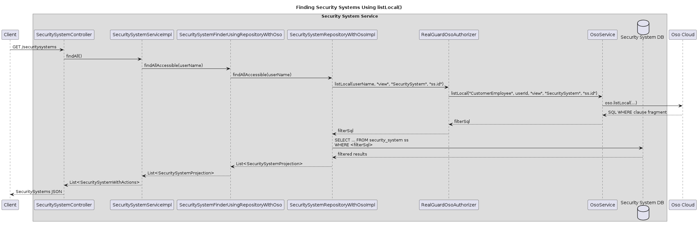
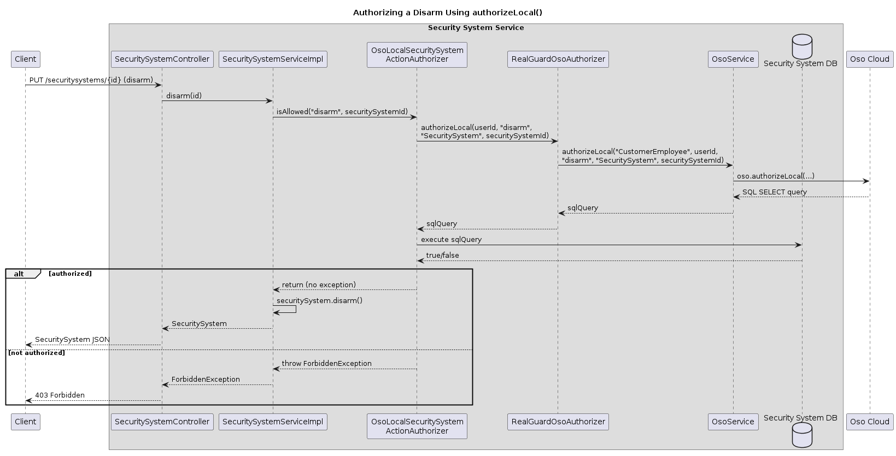

# Code Guide: Implementing Complex Authorization Using Oso Cloud Local Authorization

This guide helps readers of the article [Implementing complex authorization using Oso Cloud local authorization](https://microservices.io/post/architecture/2026/02/13/microservices-authn-authz-part-6-oso-local-authorization.html) navigate the RealGuardIO example codebase.

Note: this guide was generated by Claude Code using the following [prompt](article-prompts/part-6-prompt.md).

## Overview

Part 5 of the series introduced Oso Cloud for centralized authorization, where all facts are stored in Oso Cloud and every authorization decision requires a remote API call.
Part 6 addresses the inefficiency of that approach for bulk operations like `findSecuritySystems()` by introducing Oso Cloud's local authorization feature.
With local authorization, Oso generates SQL fragments that the service executes against its own database, combining Oso-stored facts with locally stored data to make authorization decisions without per-entity remote calls.

This guide maps the article's concepts to the architectural elements that implement them: the local authorization configuration files, the `listLocal()` and `authorizeLocal()` methods, the new adapter implementations, and the event publishing policy that eliminates unnecessary event replication.

## Key Components

The key components of the Oso Cloud local authorization feature are:

* **Oso Cloud** - An external cloud-based authorization service
  * Generates SQL fragments from its Polar policy and stored facts, combined with locally defined fact mappings
  * Provides `listLocal()` to generate WHERE clause fragments for bulk queries
  * Provides `authorizeLocal()` to generate SQL that checks a single authorization decision
* **Security System Service** - A microservice that manages security systems
  * Uses `listLocal()` to implement `findSecuritySystems()` efficiently, filtering results in a single database query
  * Uses `authorizeLocal()` to check arm/disarm permissions by executing Oso-generated SQL locally
  * Controls whether to publish `SecuritySystemAssignedToLocation` events via a policy, since local authorization can resolve the relationship from the database
  * Integrates with Oso Cloud via `RealGuardOsoAuthorizer` and `OsoService` — key integration classes defined in the shared `oso-service` library module and running in-process within this service

## Oso Cloud

Oso Cloud generates SQL fragments based on its Polar policy and stored facts.
When local authorization is configured, Oso can also incorporate locally defined fact mappings, producing SQL that joins Oso-stored facts with local database data.

### Local authorization configuration

The local authorization configuration file tells Oso how to map Polar predicates to local SQL queries.
There are two variants, selected by Spring profile:

**[local_authorization_config.yaml](../../realguardio-security-system-service/security-system-service-oso-integration/src/main/resources/local_authorization_config.yaml)** - default configuration where all facts are stored in Oso Cloud:

```yaml
facts:

sql_types:
  Location: integer
  SecuritySystem: integer
```

**[local_authorization_config_with_security_system_location.yaml](../../realguardio-security-system-service/security-system-service-oso-integration/src/main/resources/local_authorization_config_with_security_system_location.yaml)** - configuration with a local fact mapping for the SecuritySystem-Location relationship:

```yaml
facts:
  "has_relation(SecuritySystem:_, String:location, Location:_)":
    query: 'SELECT id, location_id FROM security_system WHERE location_id IS NOT NULL'

sql_types:
  Location: integer
  SecuritySystem: integer
```

The `facts` section maps the Polar predicate `has_relation(SecuritySystem, "location", Location)` to a SQL SELECT query.
Instead of storing this relationship as a fact in Oso Cloud, the generated SQL will query the `security_system` table directly.
The `sql_types` section declares that `Location` and `SecuritySystem` primary keys are integers, enabling Oso to generate type-safe SQL.

## Oso Cloud Integration Classes

The `oso-service` library module (defined in `realguardio-oso-integration-service`) provides the key classes for integrating with Oso Cloud.
These classes run in-process within the Security System Service.

### OsoService and RealGuardOsoAuthorizer

**[OsoService.java](../../realguardio-oso-integration-service/oso-service/src/main/java/io/realguardio/osointegration/ososervice/OsoService.java)** exposes `listLocal()` and `authorizeLocal()` methods that call the Oso SDK:

```java
public String listLocal(String actorType, String actorId, String action,
                         String resourceType, String column) {
    return oso.listLocal(new Value(actorType, actorId), action, resourceType, column);
}

public String authorizeLocal(String actorType, String actorId, String action,
                              String resourceType, String resourceId) {
    return oso.authorizeLocal(
            new Value(actorType, actorId), action,
            new Value(resourceType, resourceId));
}
```

`listLocal()` returns a SQL WHERE clause fragment (e.g., `ss.id IN (202, 203)`) for filtering bulk query results.
`authorizeLocal()` returns a complete SQL SELECT statement that evaluates to true or false for a single resource.

**[RealGuardOsoAuthorizer.java](../../realguardio-oso-integration-service/oso-service/src/main/java/io/realguardio/osointegration/ososervice/RealGuardOsoAuthorizer.java)** wraps `OsoService` with resilience patterns and provides the methods used by adapters in other services:

```java
public String listLocal(String userId, String action, String resourceType, String column) {
    return osoService.listLocal("CustomerEmployee", userId, action, resourceType, column);
}

public String authorizeLocal(String userId, String action, String resourceType,
                              String resourceId) {
    return osoService.authorizeLocal("CustomerEmployee", userId, action,
            resourceType, resourceId);
}
```

### Configuring the Oso client with local authorization

**[OsoServiceConfiguration.java](../../realguardio-oso-integration-service/oso-service/src/main/java/io/realguardio/osointegration/ososervice/OsoServiceConfiguration.java)** creates the Oso client bean, optionally passing the local authorization configuration file:

```java
@Bean
public Oso oso(@Value("${oso.url}") String osoUrl,
               @Value("${oso.auth}") String osoAuth) {
    var optionsBuilder = new OsoClientOptions.Builder();
    if (localAuthorizationConfigFileSupplier != null) {
        optionsBuilder.withDataBindingsPath(localAuthorizationConfigFileSupplier.get());
    }
    return new Oso(osoAuth, URI.create(osoUrl), optionsBuilder.build());
}
```

**[LocalAuthorizationConfigFileSupplier.java](../../realguardio-oso-integration-service/oso-service/src/main/java/io/realguardio/osointegration/ososervice/LocalAuthorizationConfigFileSupplier.java)** is the port (interface) for supplying the configuration file path:

```java
public interface LocalAuthorizationConfigFileSupplier extends Supplier<Path> {
}
```

**[ClasspathLocalAuthorizationConfigFileSupplier.java](../../realguardio-security-system-service/security-system-service-oso-integration/src/main/java/io/eventuate/examples/realguardio/securitysystemservice/osointegration/ClasspathLocalAuthorizationConfigFileSupplier.java)** is the adapter that loads the YAML file from the classpath.
It handles Java's Virtual FileSystem to support loading resources from nested JAR files (a Spring Boot packaging challenge):

```java
URI uri = url.toURI();
switch (uri.getScheme()) {
    case "file" -> { return Paths.get(uri); }
    case "jar" -> {
        fs = FileSystems.newFileSystem(uri, Map.of());
        return Path.of(uri);
    }
    default -> { /* copy to temp file */ }
}
```

## Security System Service

The Security System Service uses local authorization for two scenarios: filtering security systems for bulk queries (`findSecuritySystems()`) and checking permissions for individual operations (arm/disarm).

### Domain: business logic, authorization port, and finder port

The `security-system-service-domain` module contains the core business logic and port interfaces.

**[SecuritySystemServiceImpl.java](../../realguardio-security-system-service/security-system-service-domain/src/main/java/io/eventuate/examples/realguardio/securitysystemservice/domain/SecuritySystemServiceImpl.java)** uses both the `SecuritySystemFinder` and `SecuritySystemActionAuthorizer` ports:

```java
@Override
public List<SecuritySystemWithActions> findAll() {
    if (userNameSupplier.isCustomerEmployee())
        return securitySystemFinder.findAllAccessible(userNameSupplier.getCurrentUserName())
            .stream()
            .map(SecuritySystemProjection::toSecuritySystemWithActions)
            .toList();
    else
        return securitySystemRepository.findAll().stream()
            .map(this::toSecuritySystemWithActions)
            .toList();
}
```

```java
@Override
public SecuritySystem disarm(Long id) {
    ...
    if (userNameSupplier.isCustomerEmployee())
        securitySystemActionAuthorizer.isAllowed(RolesAndPermissions.DISARM, id);
    securitySystem.disarm();
    return securitySystemRepository.save(securitySystem);
}
```

**[SecuritySystemFinder.java](../../realguardio-security-system-service/security-system-service-domain/src/main/java/io/eventuate/examples/realguardio/securitysystemservice/domain/SecuritySystemFinder.java)** is the port for finding accessible security systems:

```java
public interface SecuritySystemFinder {
    List<SecuritySystemProjection> findAllAccessible(String userName);
}
```

**[SecuritySystemActionAuthorizer.java](../../realguardio-security-system-service/security-system-service-domain/src/main/java/io/eventuate/examples/realguardio/securitysystemservice/domain/SecuritySystemActionAuthorizer.java)** is the port for checking individual permissions:

```java
public interface SecuritySystemActionAuthorizer {
  void isAllowed(String permission, long securitySystemId);
}
```

### Outbound adapter: `findSecuritySystems()` using `listLocal()`

**[SecuritySystemRepositoryWithOso.java](../../realguardio-security-system-service/security-system-service-domain/src/main/java/io/eventuate/examples/realguardio/securitysystemservice/domain/SecuritySystemRepositoryWithOso.java)** is the port for Oso-filtered queries:

```java
public interface SecuritySystemRepositoryWithOso {
    List<SecuritySystemProjection> findAllAccessible(String userName);
}
```

**[SecuritySystemRepositoryWithOsoImpl.java](../../realguardio-security-system-service/security-system-service-persistence/src/main/java/io/eventuate/examples/realguardio/securitysystemservice/persistence/finder/oso/SecuritySystemRepositoryWithOsoImpl.java)** in the `security-system-service-persistence` module calls `listLocal()` to get a SQL filter and appends it to the query:

```java
@Override
public List<SecuritySystemProjection> findAllAccessible(String userName) {
    String filterSql = realGuardOsoAuthorizer.listLocal(userName,
            RolesAndPermissions.VIEW, "SecuritySystem", "ss.id");
    String query = """
            SELECT ss.id AS id, ss.location_name AS locationName,
                   ss.state AS state, ss.location_id AS locationId,
                   ss.rejection_reason AS rejectionReason,
                   ss.version AS version,
                   (SELECT COALESCE(array_agg(DISTINCT role_name), ARRAY[]::VARCHAR[])
                    FROM (...) all_roles) AS roles
            FROM security_system ss
            WHERE
            """ + filterSql;
    return jdbcTemplate.query(query, ...);
}
```

The `listLocal()` call returns a SQL fragment such as `ss.id IN (202, 203)`.
When the local fact mapping for SecuritySystem-Location is configured, the fragment becomes a more complex common table expression that joins Oso-stored facts with local database queries.

**[SecuritySystemFinderUsingRepositoryWithOso.java](../../realguardio-security-system-service/security-system-service-persistence/src/main/java/io/eventuate/examples/realguardio/securitysystemservice/persistence/finder/oso/SecuritySystemFinderUsingRepositoryWithOso.java)** adapts `SecuritySystemRepositoryWithOso` to the `SecuritySystemFinder` port:

```java
public class SecuritySystemFinderUsingRepositoryWithOso implements SecuritySystemFinder {
    @Override
    public List<SecuritySystemProjection> findAllAccessible(String userName) {
        return securitySystemRepository.findAllAccessible(userName);
    }
}
```

### Outbound adapter: arm/disarm authorization using `authorizeLocal()`

**[OsoLocalSecuritySystemActionAuthorizer.java](../../realguardio-security-system-service/security-system-service-oso-integration/src/main/java/io/eventuate/examples/realguardio/securitysystemservice/osointegration/OsoLocalSecuritySystemActionAuthorizer.java)** in the `security-system-service-oso-integration` module calls `authorizeLocal()` and executes the resulting SQL locally:

```java
@Override
protected void isAllowedForCustomerEmployee(String permission, long securitySystemId) {
    String userId = userNameSupplier.getCurrentUserName();
    String sqlQuery = realGuardOsoAuthorizer.authorizeLocal(userId, permission,
            "SecuritySystem", String.valueOf(securitySystemId));
    Boolean allowed = jdbcTemplate.queryForObject(sqlQuery, Boolean.class);
    if (!Boolean.TRUE.equals(allowed)) {
        throw new ForbiddenException(...);
    }
}
```

This contrasts with `OsoSecuritySystemActionAuthorizer` (from Part 5), which calls `oso.authorize()` remotely.
The local version gets a SQL query from Oso and executes it against the service's own database using `JdbcTemplate`.

### Domain: event publishing policy

The `SecuritySystemLocationEventPublishingPolicy` port determines whether `SecuritySystemAssignedToLocation` events need to be published.
When local authorization resolves the SecuritySystem-Location relationship from the database, publishing the event is unnecessary.

**[SecuritySystemLocationEventPublishingPolicy.java](../../realguardio-security-system-service/security-system-service-domain/src/main/java/io/eventuate/examples/realguardio/securitysystemservice/domain/SecuritySystemLocationEventPublishingPolicy.java)** is the port:

```java
public interface SecuritySystemLocationEventPublishingPolicy {
    boolean shouldPublishSecuritySystemAssignedToLocation();
}
```

**[SecuritySystemServiceImpl.java](../../realguardio-security-system-service/security-system-service-domain/src/main/java/io/eventuate/examples/realguardio/securitysystemservice/domain/SecuritySystemServiceImpl.java)** uses the policy when creating a security system:

```java
if (eventPublishingPolicy.shouldPublishSecuritySystemAssignedToLocation()) {
    securitySystemEventPublisher.publish(savedSystem,
        new SecuritySystemAssignedToLocation(savedSystem.getId(), locationId));
}
```

This port has two implementations, selected by Spring profile:

#### Default policy (centralized facts)

**[DefaultSecuritySystemLocationEventPublishingPolicy.java](../../realguardio-security-system-service/security-system-service-domain/src/main/java/io/eventuate/examples/realguardio/securitysystemservice/domain/DefaultSecuritySystemLocationEventPublishingPolicy.java)** returns `true` - events are published so the Oso Integration Service can create facts in Oso Cloud:

```java
@Component
@Profile("!OsoLocalSecuritySystemLocation")
public class DefaultSecuritySystemLocationEventPublishingPolicy
        implements SecuritySystemLocationEventPublishingPolicy {
    @Override
    public boolean shouldPublishSecuritySystemAssignedToLocation() {
        return true;
    }
}
```

#### Local policy (local facts)

**[LocalSecuritySystemLocationEventPublishingPolicy.java](../../realguardio-security-system-service/security-system-service-oso-integration/src/main/java/io/eventuate/examples/realguardio/securitysystemservice/osointegration/LocalSecuritySystemLocationEventPublishingPolicy.java)** returns `false` - the SecuritySystem-Location relationship is resolved locally via database queries, so the event is not needed:

```java
@Component
@Profile("OsoLocalSecuritySystemLocation")
public class LocalSecuritySystemLocationEventPublishingPolicy
        implements SecuritySystemLocationEventPublishingPolicy {
    @Override
    public boolean shouldPublishSecuritySystemAssignedToLocation() {
        return false;
    }
}
```

## Switching Between Authorization Modes

The application uses Spring profiles to select which adapter implements each port.
Three modes are available for the Security System Service:

| Profiles | Authorization Mode | `SecuritySystemActionAuthorizer` | `SecuritySystemFinder` | Event Publishing |
|----------|-------------------|--------------------------------|----------------------|-----------------|
| (default) | Local database | `LocalSecuritySystemActionAuthorizer` | `SecuritySystemFinderUsingRepository` | N/A |
| `UseOsoService` | Oso Cloud (centralized) | `OsoSecuritySystemActionAuthorizer` | `SecuritySystemFinderUsingRepositoryWithOso` | Events published |
| `UseOsoService` + `OsoLocalSecuritySystemLocation` | Oso Cloud (local authorization) | `OsoLocalSecuritySystemActionAuthorizer` | `SecuritySystemFinderUsingRepositoryWithOso` | Events suppressed |

**[OsoSecuritySystemActionAuthorizerConfiguration.java](../../realguardio-security-system-service/security-system-service-oso-integration/src/main/java/io/eventuate/examples/realguardio/securitysystemservice/osointegration/OsoSecuritySystemActionAuthorizerConfiguration.java)** selects the appropriate authorizer and configuration file based on the active profiles:

```java
@Configuration
@Profile("UseOsoService")
@Import(OsoServiceConfiguration.class)
public class OsoSecuritySystemActionAuthorizerConfiguration {

  @Bean
  @Profile("!OsoLocalSecuritySystemLocation")
  public SecuritySystemActionAuthorizer cloudSecuritySystemActionAuthorizer(...) {
    return new OsoSecuritySystemActionAuthorizer(userNameSupplier, realGuardOsoAuthorizer);
  }

  @Bean
  @Profile("OsoLocalSecuritySystemLocation")
  public SecuritySystemActionAuthorizer localSecuritySystemActionAuthorizer(...) {
    return new OsoLocalSecuritySystemActionAuthorizer(userNameSupplier,
            realGuardOsoAuthorizer, jdbcTemplate);
  }

  @Bean
  @Profile("!OsoLocalSecuritySystemLocation")
  public LocalAuthorizationConfigFileSupplier defaultLocalAuthorizationConfigFileSupplier() {
      return new ClasspathLocalAuthorizationConfigFileSupplier();
  }

  @Bean
  @Profile("OsoLocalSecuritySystemLocation")
  public LocalAuthorizationConfigFileSupplier localSecuritySystemLocationConfigFileSupplier() {
      return new ClasspathLocalAuthorizationConfigFileSupplier(
              "/local_authorization_config_with_security_system_location.yaml");
  }
}
```

## Service Collaboration

### Finding security systems using `listLocal()`

When a customer employee requests the list of security systems, the Security System Service uses `listLocal()` to generate a SQL filter that restricts results to only those the user is authorized to view.



<!-- Source: diagrams/part-6/find-security-systems-list-local.txt (PlantUML) -->

1. **Client requests security systems** - The request arrives at [SecuritySystemServiceImpl.java](../../realguardio-security-system-service/security-system-service-domain/src/main/java/io/eventuate/examples/realguardio/securitysystemservice/domain/SecuritySystemServiceImpl.java), which calls `securitySystemFinder.findAllAccessible()`.
2. **Finder delegates to Oso-aware repository** - [SecuritySystemFinderUsingRepositoryWithOso.java](../../realguardio-security-system-service/security-system-service-persistence/src/main/java/io/eventuate/examples/realguardio/securitysystemservice/persistence/finder/oso/SecuritySystemFinderUsingRepositoryWithOso.java) delegates to `SecuritySystemRepositoryWithOsoImpl`.
3. **Repository calls `listLocal()` via integration classes** - [SecuritySystemRepositoryWithOsoImpl.java](../../realguardio-security-system-service/security-system-service-persistence/src/main/java/io/eventuate/examples/realguardio/securitysystemservice/persistence/finder/oso/SecuritySystemRepositoryWithOsoImpl.java) calls [RealGuardOsoAuthorizer](../../realguardio-oso-integration-service/oso-service/src/main/java/io/realguardio/osointegration/ososervice/RealGuardOsoAuthorizer.java)`.listLocal()`, which delegates to [OsoService](../../realguardio-oso-integration-service/oso-service/src/main/java/io/realguardio/osointegration/ososervice/OsoService.java)`.listLocal()`, which calls the Oso SDK.
4. **Oso Cloud generates SQL fragment** - Oso combines its stored facts with the local authorization configuration to generate a SQL fragment (e.g., `ss.id IN (202, 203)` or a more complex CTE when local facts are configured).
5. **Repository executes combined query** - The repository appends the SQL fragment to its query and executes it against the local database via `JdbcTemplate`, returning only the security systems the user is authorized to view.

### Authorizing a disarm using `authorizeLocal()`

When a customer employee requests to disarm a security system, the Security System Service uses `authorizeLocal()` to generate a SQL query that checks the permission locally.



<!-- Source: diagrams/part-6/authorize-disarm-local.txt (PlantUML) -->

1. **Client calls disarm** - The request arrives at [SecuritySystemServiceImpl.java](../../realguardio-security-system-service/security-system-service-domain/src/main/java/io/eventuate/examples/realguardio/securitysystemservice/domain/SecuritySystemServiceImpl.java).
2. **Domain calls the authorization port** - `SecuritySystemServiceImpl` calls `securitySystemActionAuthorizer.isAllowed("disarm", securitySystemId)`.
3. **Abstract base class checks user type** - [AbstractSecuritySystemActionAuthorizer.java](../../realguardio-security-system-service/security-system-service-domain/src/main/java/io/eventuate/examples/realguardio/securitysystemservice/domain/AbstractSecuritySystemActionAuthorizer.java) only checks authorization for customer employees.
4. **Local authorizer calls `authorizeLocal()` via integration classes** - [OsoLocalSecuritySystemActionAuthorizer.java](../../realguardio-security-system-service/security-system-service-oso-integration/src/main/java/io/eventuate/examples/realguardio/securitysystemservice/osointegration/OsoLocalSecuritySystemActionAuthorizer.java) calls [RealGuardOsoAuthorizer](../../realguardio-oso-integration-service/oso-service/src/main/java/io/realguardio/osointegration/ososervice/RealGuardOsoAuthorizer.java)`.authorizeLocal()`, which delegates to [OsoService](../../realguardio-oso-integration-service/oso-service/src/main/java/io/realguardio/osointegration/ososervice/OsoService.java)`.authorizeLocal()`, which calls the Oso SDK.
5. **Oso Cloud generates SQL query** - Oso generates a SQL SELECT statement that evaluates to true or false, incorporating both Oso-stored facts and the local fact mapping.
6. **Local authorizer executes query** - The authorizer executes the SQL via `JdbcTemplate.queryForObject()`. If the result is `false`, a `ForbiddenException` is thrown.

## Project Structure

| Service | Module | Architectural Role | Key Files |
|---------|--------|--------------------|-----------|
| Oso Cloud | [config files](../../realguardio-security-system-service/security-system-service-oso-integration/src/main/resources) | External service configuration | [local_authorization_config.yaml](../../realguardio-security-system-service/security-system-service-oso-integration/src/main/resources/local_authorization_config.yaml), [local_authorization_config_with_security_system_location.yaml](../../realguardio-security-system-service/security-system-service-oso-integration/src/main/resources/local_authorization_config_with_security_system_location.yaml) |
| Security System | [oso-service](../../realguardio-oso-integration-service/oso-service/src/main/java/io/realguardio/osointegration/ososervice) (shared library) | Oso Cloud integration | [OsoService.java](../../realguardio-oso-integration-service/oso-service/src/main/java/io/realguardio/osointegration/ososervice/OsoService.java), [RealGuardOsoAuthorizer.java](../../realguardio-oso-integration-service/oso-service/src/main/java/io/realguardio/osointegration/ososervice/RealGuardOsoAuthorizer.java), [OsoServiceConfiguration.java](../../realguardio-oso-integration-service/oso-service/src/main/java/io/realguardio/osointegration/ososervice/OsoServiceConfiguration.java), [LocalAuthorizationConfigFileSupplier.java](../../realguardio-oso-integration-service/oso-service/src/main/java/io/realguardio/osointegration/ososervice/LocalAuthorizationConfigFileSupplier.java) |
| Security System | [security-system-service-domain](../../realguardio-security-system-service/security-system-service-domain/src/main/java/io/eventuate/examples/realguardio/securitysystemservice/domain) | Domain (ports + event publishing policy) | [SecuritySystemServiceImpl.java](../../realguardio-security-system-service/security-system-service-domain/src/main/java/io/eventuate/examples/realguardio/securitysystemservice/domain/SecuritySystemServiceImpl.java), [SecuritySystemFinder.java](../../realguardio-security-system-service/security-system-service-domain/src/main/java/io/eventuate/examples/realguardio/securitysystemservice/domain/SecuritySystemFinder.java), [SecuritySystemActionAuthorizer.java](../../realguardio-security-system-service/security-system-service-domain/src/main/java/io/eventuate/examples/realguardio/securitysystemservice/domain/SecuritySystemActionAuthorizer.java), [SecuritySystemLocationEventPublishingPolicy.java](../../realguardio-security-system-service/security-system-service-domain/src/main/java/io/eventuate/examples/realguardio/securitysystemservice/domain/SecuritySystemLocationEventPublishingPolicy.java) |
| Security System | [security-system-service-oso-integration](../../realguardio-security-system-service/security-system-service-oso-integration/src/main/java/io/eventuate/examples/realguardio/securitysystemservice/osointegration) | Outbound adapter (local authorization) | [OsoLocalSecuritySystemActionAuthorizer.java](../../realguardio-security-system-service/security-system-service-oso-integration/src/main/java/io/eventuate/examples/realguardio/securitysystemservice/osointegration/OsoLocalSecuritySystemActionAuthorizer.java), [OsoSecuritySystemActionAuthorizerConfiguration.java](../../realguardio-security-system-service/security-system-service-oso-integration/src/main/java/io/eventuate/examples/realguardio/securitysystemservice/osointegration/OsoSecuritySystemActionAuthorizerConfiguration.java), [ClasspathLocalAuthorizationConfigFileSupplier.java](../../realguardio-security-system-service/security-system-service-oso-integration/src/main/java/io/eventuate/examples/realguardio/securitysystemservice/osointegration/ClasspathLocalAuthorizationConfigFileSupplier.java), [LocalSecuritySystemLocationEventPublishingPolicy.java](../../realguardio-security-system-service/security-system-service-oso-integration/src/main/java/io/eventuate/examples/realguardio/securitysystemservice/osointegration/LocalSecuritySystemLocationEventPublishingPolicy.java) |
| Security System | [security-system-service-persistence](../../realguardio-security-system-service/security-system-service-persistence/src/main/java/io/eventuate/examples/realguardio/securitysystemservice/persistence/finder/oso) | Outbound adapter (Oso-filtered queries) | [SecuritySystemRepositoryWithOsoImpl.java](../../realguardio-security-system-service/security-system-service-persistence/src/main/java/io/eventuate/examples/realguardio/securitysystemservice/persistence/finder/oso/SecuritySystemRepositoryWithOsoImpl.java), [SecuritySystemFinderUsingRepositoryWithOso.java](../../realguardio-security-system-service/security-system-service-persistence/src/main/java/io/eventuate/examples/realguardio/securitysystemservice/persistence/finder/oso/SecuritySystemFinderUsingRepositoryWithOso.java) |
