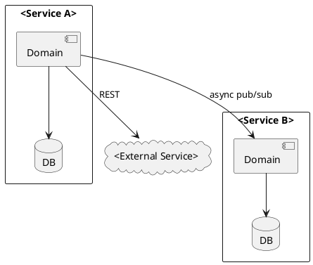

# Code Guide: <Article Title>

This guide helps readers of the article [<Article Title>](<article URL>) navigate the RealGuardIO example codebase.

The code guides for the other articles are:

* [<Other Article Title 1>](<relative link to other guide>)
* [<Other Article Title 2>](<relative link to other guide>)

Note: this guide was generated by Claude Code using the following [prompt](article-prompts/part-N-prompt.md).

## Overview

Brief description of what the article demonstrates and how this guide maps article concepts to architectural elements: services, modules, classes, and collaboration patterns.

## Key Components

The following diagram shows the key components of the <feature>.


<!-- Source: diagrams/part-N/key-components.txt (PlantUML) -->

A PlantUML component diagram in `diagrams/part-N/key-components.txt` showing the key components and their interactions. Diagram guidelines:

* Use `cloud` for external services
* Use `component` within a `package` or `rectangle` for each microservice
* Use `database` for each service's data store
* Label arrows with the interaction style (e.g., "REST", "async pub/sub", "events")
* Place shared library classes inside the service `rectangle` where they run at runtime, not in the service where their source is defined
* Group related components visually



The responsibilities of each component are as follows:

* **<External Service>** - An external cloud-based service that ...
  * Sub-bullet describing a responsibility
  * Sub-bullet describing a responsibility
* **<Service Name>** - A microservice that ...
  * Sub-bullet describing its role in the feature, referencing collaboration pattern (e.g., "asynchronous pub/sub")
  * Sub-bullet describing its role in the feature
* **<Service Name>** - A microservice that ...
  * Sub-bullet describing its role
  * Sub-bullet describing its role

## <External Service>

Brief description of the external service and how the application interacts with it (e.g., via REST APIs).

### <Sub-topic>

Description and link to relevant artifact (e.g., policy file, configuration).

Key excerpts with code blocks.

## <Service Name>

Brief description of the service's role in the feature.
Identify its collaboration patterns with other services (e.g., "collaborates with X via asynchronous publish/subscribe, and with Y via synchronous REST calls").

### Inbound adapter: <adapter description>

Identify the module (e.g., `<module-name>`) and its architectural role.

**[ClassName.java](relative link to file)** - brief description:

```java
// Key code excerpt
```

### Domain: <domain description>

Identify the module and its architectural role.

**[ClassName.java](relative link to file)** - brief description:

```java
// Key code excerpt
```

### Outbound adapter: <adapter description>

**[ClassName.java](relative link to file)** - brief description:

```java
// Key code excerpt
```

## <Service Name>

Brief description of the service's role in the feature.

### Domain: business logic and <port name> port

Identify the module.

**[ServiceClass.java](relative link)** - show how business logic uses the port:

```java
// Key code excerpt showing port usage
```

**[PortInterface.java](relative link)** - the port (interface):

```java
public interface PortInterface {
  void method(args);
}
```

This port has N implementations, selected by <mechanism>:

#### <Implementation A> adapter

**[ImplA.java](relative link)** - brief description of approach:

```java
// Key code excerpt
```

#### <Implementation B> adapter

**[ImplB.java](relative link)** in the `<module-name>` module - brief description of approach:

```java
// Key code excerpt
```

## Service Collaboration

Each scenario has a PlantUML sequence diagram in `diagrams/part-N/<scenario>.txt`. Diagram guidelines:

* Start with a `Client` participant representing the external caller
* Include the inbound adapter class that handles the client request
* A service's database belongs inside the service's `box`
* Use `box` to group participants by the runtime service they execute in

```plantuml
participant "Client" as C

box "Service Name"
  participant "InboundAdapter" as IA
  participant "ClassName" as alias
  database "Service DB" as DB
end box
```

### <Scenario Name>


<!-- Source: diagrams/part-N/<scenario>.txt (PlantUML) -->

1. **<Step description>** - The `<Service A>` does X. See [ClassName.java](relative link).
2. **<Step description>** - The `<Service B>` does Y. See [ClassName.java](relative link).
3. **<Step description>** - The `<External Service>` does Z.

### <Scenario Name>


<!-- Source: diagrams/part-N/<scenario>.txt (PlantUML) -->

1. **<Step description>** - ...
2. **<Step description>** - ...

## Project Structure

| Service | Module | Architectural Role | Key Files |
|---------|--------|--------------------|-----------|
| Service A | [module-name](relative link) | Domain / Inbound adapter / Outbound adapter | [File.java](relative link) |
